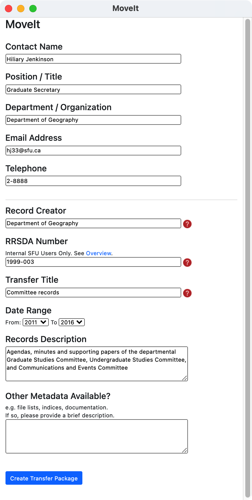

###### [Digital Transfer](../../README.md)
###### Standard Transfer `|` [Procedures for Producers](../standard-producers/00-introduction.md) `|` [Procedures for Archives](../standard-archives/00-introduction.md)

# Appendix A. Transfer Metadata

SFU MoveIt requires users to enter transfer information into a number of fields, capturing the data as part of the transfer package.
- See the producer procedures, [step 2.3](../standard-producers/02-transfer#23-create-a-transfer-package-with-sfu-moveit).

This guide describes each field.
- Always complete each field that is applicable.
- Mandatory fields are indicated with an asterisk (*).

## Contact information
These fields describe the person who is the transfer contact.
- The **contact** is the person who is responsible for creating the package and the person the Archives will seek out for follow-up questions and clarifications.

The first time you open SFU MoveIt, **contact information** fields will be blank; subsequently it will default to whatever values were entered when the application was last used.

### Name (*)
Enter your name in any format, e.g. `FirstName LastName` or `LastName, FirstName`.
- Always include your full first name, not just an initial.

### Position / Title
Give your official job title.

### Department / Organization
Provide the name of your SFU department or external organization.
- Use the full name, e.g. "Department of Geography" rather than just "Geography".

### Email Address (*)
Provide your business contact email.
- For SFU staff transferring university records, this should always be your SFU email address.

### Telephone
Give the phone number at which you can be reached during business hours.
- An archivist may call you to request clarifications during [transfer validation](../standard-archives/03-validation.md).
- For SFU contacts, it is fine to give the abbreviated number, e.g. 2-2380.

## Records description
These fields describe the materials being transferred.

### Records Creator
For SFU transfers, enter the name of the SFU unit responsible for creating and maintaining the records.
- Give the full name of the unit (e.g. "Department of English" rather than just "English").

For transfers of privately donated materials, enter the name of the organization, family, or person responsible for creating and maintaining the records.
- This should be the same as the entity named in the Donation Agreement.

Often the value in this field will be the same as the [Department / Organization](#department-organization) entered above, but they can be different. For example, your department (the unit for which you work) is Student Services but records you are transferring were created by the Senate Committee on Undergraduate Studies (SCUS).
- Here one body (Student Services) is acting as the secretariat for a different body (SCUS) that created the records.
- `Department / Organization` = "Student Services"; `Records Creator` = "Senate Committee on Undergraduate Studies".

### RRSDA Number
**Use for SFU transfers only.**
- Private donors should leave this field blank.

Enter the Records Retention Schedule and Disposal Authority (RRSDA) that applies to the records.
- Enter the RRSDA number in the form `YYYY-NNN` (e.g. "1999-003").
- Note that the 4-digit prefix in an RRSDA number just represents the year in which the schedule was drafted. It has no significance for application, i.e. as long as the RRSDA is **in force** it applies to records created in any given year.
- For a list of all RRSDAs, see the online [Directory of University Records (DUR)](http://www.sfu.ca/archives2/dur/rrsdas.html).
- **Records subject to different RRSDAs must be packaged separately.**

### Transfer Title (*)
Give a brief title that reflects the contents of the transfer.
- For university records, model the title on the name of the applicable RRSDA, but be more specific when appropriate (e.g. "Departmental Graduate Studies Committee files" rather than just "Committee files").
- SFU MoveIt uses the `Transfer title` as the name of the transfer package zip file.

### Date range
Pick the start and end years for the range covered by the records, oldest to most recent (e.g. "2010–2014").
- If uncertain, give your best estimate.
- Use the `Records Description` field to elaborate if required.

### Records Description
Enter any descriptive information that will help the Archives understand what the records are and how they were created and maintained.
-	Indicate if the records contain confidential or sensitive personal information.

### Other Metadata Available?
This refers to other documentation that contains information about the records in your transfer.

Examples include indexes and content listings; descriptive information or metadata stored in databases or other systems; systems documentation and manuals.
-	Leave this field blank if not applicable.
- If you do list other metadata here, an archivist will follow up with you to discuss whether it should be transferred and if so, how.

###### Last updated: Jan 20, 2021
###### [Appendix B. Anatomy of the transfer package >](b-anatomy-transfer-package.md)
