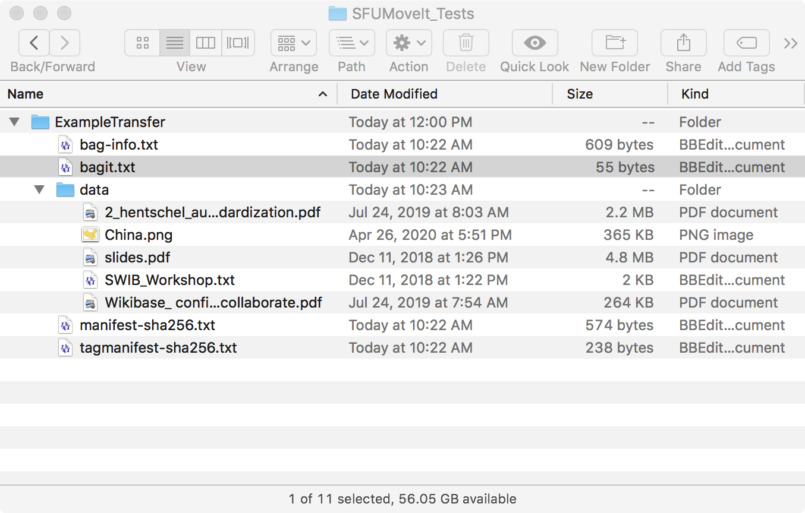
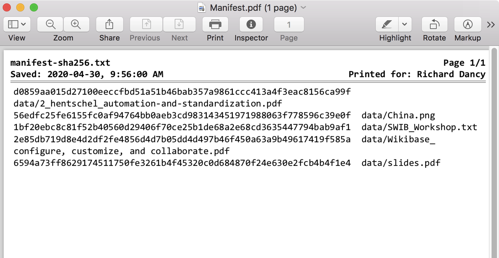

###### [Digital Transfer](../../README.md) > Standard Transfer `|` [Procedures for Producers](../standard-producers/00-introduction.md) `|` [Procedures for Archives](../standard-archives/00-introduction.md)
###### [Appendices](overview.md) `|` [A. Transfer Metadata](a-transfer-metadata.md) `|` B. Anatomy of the Transfer Package `|` [C. Post-transfer](c-post-transfer.md)

# Appendix B. Anatomy of the Transfer Package
SFU MoveIt creates a transfer package as a single zip file on the user's desktop. This page describes how the package is structured.

The transfer package contains a **copy** of target folder that the user is prompted to select.
- The original target folder is unaffected and remains in place.
- The name of the transfer package is based on the value the user supplied in MoveIt's `Transfer Title` field (**not** on the name of the original target folder).

## Bag

The transfer package is a zipped **bag** – a container that adheres to the [BagIt File Packaging Format](https://tools.ietf.org/html/rfc8493), "a set of hierarchical file layout conventions for storage and transfer of arbitrary digital content" (from the BagIt specification Abstract).

Unzip the file to see how the bag is structured.
- It comprises four "tag" `.txt` files, plus a `data` folder that contains the transfer contents.

`bag-info.txt`
- Captures data supplied by the user on the SFU MoveIt interface (in [step 2.3 of the producer procedures](../standard-producers/02-transfer.md#23-create-a-transfer-package-with-sfu-moveit)).
- Includes some auto-generated metadata, e.g. `Package-Time`.
- Field names follow the conventions of the BagIt specification.

`bagit.txt`
- Identifies the directory as a **bag**, gives the version of the BagIt specification used, and the character encoding used for tag files.
- SFU MoveIt uses "0.97" as the `BagIt-Version` value, even though the latest version of BagIt is 1.0.
- The MoveIt bag does in fact comply with BagIt 1.0, but this value will cause an error with an older tool ([Bagger](https://github.com/SFU-Archives/digital-repository-utilities/blob/master/utilities/bagger.md)) the Archives uses in its [validation workflow](../standard-archives/03-validation.md); so we have left "0.97" as the version value.

`data folder`
- Contains the actual transfer files in their original directory structure.

`manifest-sha256.txt`
- Lists all the files in the data folder, each with a checksum generated by the SHA256 algorithm (see below for more on [checksums](#checksums)).

`tagmanifest-sha256.txt`
- Lists all the tag files with their checksums.

## Checksums

SFU MoveIt creates **checksums** for each file included in your transfer and records the values in the bag's `manifest` file.
- A checksum is an alpha-numeric value calculated by an algorithm applied to the file's underlying bitstream (the string of 0s and 1s).
- A checksum functions as a kind of **digital fingerprint**: any change to the bitstream will result in a completely different value when the same algorithm is applied.

Following deposit, the Archives runs a tool ([Bagger](https://github.com/SFU-Archives/digital-repository-utilities/blob/master/utilities/bagger.md)) that compares the files' pre-transfer checksums (stored in the `manifest` file) with checksums that Bagger generates post-transfer.
- If the values are different, something happened to the data (corruption or loss) during transmission.
-	In the event a checksum validation fail, the Archives will contact the producer and ask them to re-send.

Checksums also provide a check against the Archives itself inadvertently changing any data during the inspection of the files during the [validation phase](../standard-archives/03-validation.md).

###### Last updated: Jan 28, 2021
