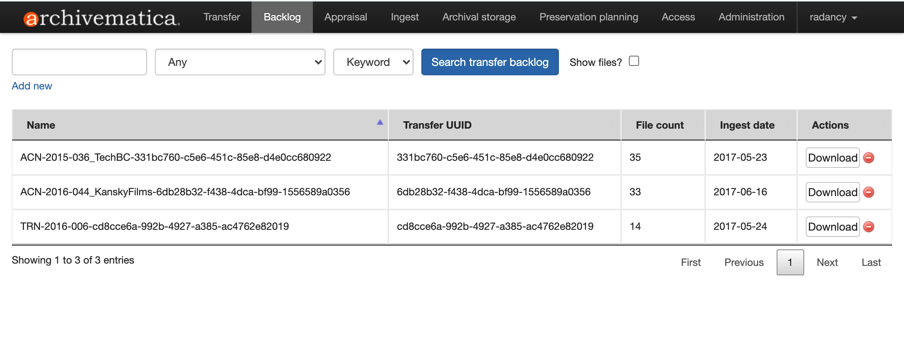

###### [Digital Transfer](../../README.md) > [Standard Transfer: Procedures for Producers](00-introduction.md)
###### [1. Pre-Transfer](01-pre-transfer.md) `|` [2. Transfer](02-transfer.md) `|` [3. Validation / Ingest](03-validation-ingest.md) `|` [4. Completion](04-completion.md) `|` 5. Post-transfer

# Appendix C. Post-transfer
From the standpoint of the producer sending records to the Archives, a transfer is **complete** once the Archives has accessioned the records into its preservation system and assumed custody and control over them. For the Archives, however, this is just the first step in a longer process of preserving the records and making them accessible over time. This page briefly describes what happens to the records post-transfer and how producers can access them.

## Contents
- [Backlog](#backlog)
- [Archival processing](#archival-processing)
- [Retrieval requests](#retrieval-requests)

## Backlog

On completion of a transfer, the Archives sends the transfer package to **backlog storage**. The records remain in backlog until an archivist:
- Completes preservation processing in Archivematica.
- Arranges and describes ("catalogues") the materials in [SFU AtoM](https://atom.archives.sfu.ca), the Archives' online finding aid system.

**Note that there may be a considerable time lag between accessioning (backlog) and full processing (arrangement and description).**

## Archival processing
Processing involves the arrangement and description of the materials, their integration into the existing archival holdings of the records creator, and the transformation of the transfer package into a standardized **Archival Information Package** (AIP).

The Archives always retains records in the original file formats in which they were transferred, but it may also make "normalized" copies in other formats according to rules set out in the Archives' [Format Policy Registry (FPR)](https://www.sfu.ca/content/dam/sfu/archives/PDFs/DigitalPreservation/LinksResources/FormatPolicyRegistry.pdf).
- For more on file formats, see the remarks in [section 2.1](../standard-producers/02-transfer.md#file-formats) of the producer transfer procedures.

During processing, an archivist:
- Appraises the records in more detail; some files may be weeded or destroyed as having no enduring archival value.
- Generates (through Archivematica) preservation and access copies of the files selected for retention.
- Creates (through Archivematica) the finalized AIP and sends it to offline storage.
- Assigns files to new or existing records series in the aggregate holdings ("fonds") of the records creator.
- Creates / updates finding aid descriptions in [SFU AtoM](https://atom.archives.sfu.ca).
- Reviews materials for access and copyright restrictions to determine whether or not the files themselves can be directly made available to the public through SFU AtoM.

## Retrieval requests
To obtain a copy of digital files previously transferred to Archives, it is a good practice to first check the online finding aid in [SFU AtoM](https://atom.archives.sfu.ca), as a copy may be directly available online.

Many files, however, will not be available online because:
- They are not yet described in [SFU AtoM](https://atom.archives.sfu.ca) (remain in backlog).
- They have been described, but not yet reviewed for access or copyright clearance (`Access status` = "pending review").
- They have been reviewed, and they contain confidential or personal information or are subject to third-party copyright restrictions; in these cases the records cannot be posted online for general public access.

If any of these situations apply, contact the Archives to request a retrieval.
- Refer to the [Transfer Completed Notices](../standard-producers/04-completion.md#41-receive-completion-notice) you received from Archives to locate the file in an accession.
- Email `moveit@sfu.ca` to request a copy, providing the `File title`and `Accession number`.
- An archivist will consult with you to determine the best method of delivery (e.g. via SFU Vault)/

Do not "return" your copy when you no longer need it for reference.
- The Archives retains the original file; what it has sent you is a copy.
- You can typically retain your copy if needed.
- There may be situations where you should destroy the copy when no longer needed (e.g. if it contains sensitive personal or confidential information); consult with an archivist if in doubt.
-	If you do keep a copy, revise it and / or integrate into your active records, it now becomes a new record.

###### Last updated: Jan 22, 2021
###### [< Previous – Appendix B. Anatomay of the Transfer Package](b-anatomy-transfer-package.md)
