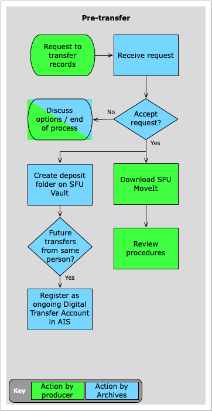
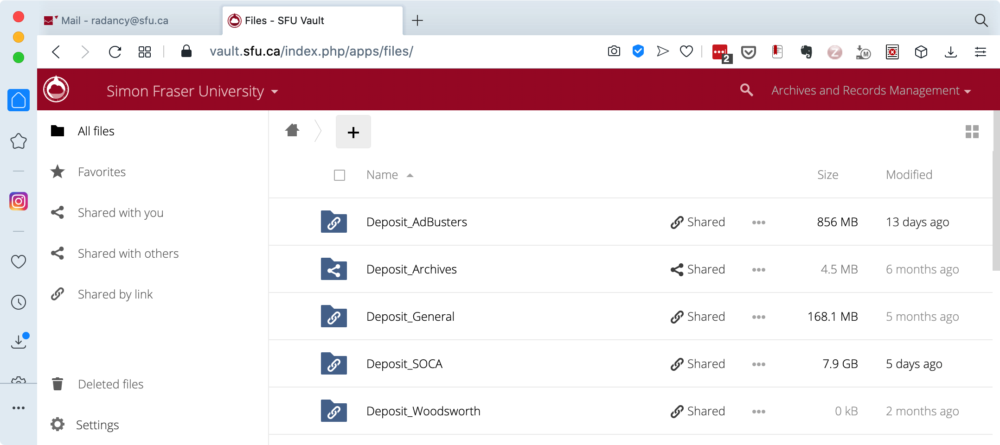

###### [Digital Transfer](../../README.md) > [Standard Transfer: Procedures for Archives](00-introduction.md)
###### 1. Pre-Transfer [2. Transfer](02-transfer.md) `|` [3. Validation](03-validation.md) `|` [4. Ingest](04-ingest.md) `|` [5. Completion](05-completion.md)

# 1. Pre-Transfer
###### Status: draft

The pre-transfer phase is typically triggered by the first request from a producer (SFU departmental staff or a private donor) to send digital materials to the Archives. An archivist [determines whether to accept or reject the request](#accept-or-reject-a-request-to-transfer). If accepted, the archivist creates a [deposit folder](#create-a-deposit-folder) on SFU Vault. If the producer will be regularly sending new transfers in the future, the archivist should create a [Digital Transfer Account](#create-a-digital-transfer-account) for the person. Once individuals have accounts, they do not need to request permission for subsequent transfers, and the transfer process more resembles a self-deposit system.

**Contents**
- [Accept or reject a request to transfer](#accept-or-a-reject-request-to-transfer)
  - [University records](#university-records)
  - [Private records](#private-records)
- [Create a deposit folder](#create-a-deposit-folder)
  - [Guidelines](#guidelines)
  - [Shares](#shares)
- [Create a Digital Transfer Account](#create-a-digital-transfer-account)

## Accept or reject a request to transfer
### University records
Any university department or body can transfer digital records to the Archives. But the following conditions should be met before accepting a proposed transfer:

- The person has the authority to transfer records on behalf of their unit.

- The records are covered by a Records Retention Schedule and Disposal Authority (RRSDA) whose final disposition = "Archival".

- The unit is the Office of Primary Responsibility (OPR) for the records.

- The total retention period for the records has expired.

Exceptions are possible and archivists should use their judgement and seek clarifications from the contact as required.

It is fairly common for departments to wish to transfer digital records to the Archives before their total retention period has expired. Often the applicable RRSDA was originally designed for paper records, with provision for off-site storage in the University Records Centre during the semi-active period. **There is currently no equivalent semi-active off-site storage for electronic records. All digital transfers are archival.**

Accepting early transfer is fine, but the archivist should make the department aware that on transfer the records cease to "belong to" the department and come under the custody and control of the Archives.

### Private records
Individual donors or non-SFU organizations should only transfer records when they have a Donation Agreement with the Archives or are in the process of negotiating one.

The following conditions should be met before accepting a proposed transfer:

- The person has the authority to transfer records on behalf of the donor.

- The records are covered by an existing Donation Agreement or negotiations for one are underway.

It is common and acceptable for donors to send materials before the Donation Agreement is finalized (e.g. so an archivist can better assess the proposed donation).

## Create a deposit folder

Under the standard transfer method, the producer will upload their transfers to a deposit folder on SFU Vault, the university's file-sharing and storage service. **Deposit folders should only be created in the Vault space associated with the Archives' `moveit@sfu.ca` email account.**

### Guidelines
Create separate deposit folders for each fonds (1 fonds = 1 folder).

Use the following naming convention when creating deposit folders: `Deposit_FondsCreatorName`

- Prefer department or organization names over personal names when creating the folders; but for personal fonds, it is fine to use the creator's name.

- The rationale for the `Deposit_` prefix is to make it easier for depositers to understand the purpose of the folder; if the folder is shared with depositors who have SFU accounts and have installed the SFU Vault desktop app, the `Depost_` folder will be directly accessible on their computers via Finder (Mac) or File Explorer (Windows).

### Shares
To provide the producer with access to the deposit folder, you can either (i) share the folder with the contact; or (ii) share a link to the folder.

- See [SFU Vault documentation](https://www.sfu.ca/itservices/collaboration/sfu-vault/faq-section/files-and-sharing/) for how to share folders by either method.

- You can only share the folder itself (method i) with someone who has an SFU email account; for external depositors, just share the link (method ii).

- When you share the folder (method i) with an SFU commnity member and that person has intsalled the desktop version of SFU Vault, they will be able to view and interact with the deposit folder directly on their computer via Finder (Mac) or File Explorer (Windows).

- External depositors and SFU members who have not installed the desktop version of Vault will access the deposit folder through a web browser. If you shared the link (method ii), it will take them directly to the deposit folder. If you shared the folder itself (method i), they must log in with their SFU credentials at https://vault.sfu.ca and navigate to the deposit folder (e.g click the sidebar link `Shared with you`).

- By either share method, you will need to allow the depositor to have `create` privileges so that they can upload their transfer.

- For more on accessing the deposit folder from the depositor's point of view, see the [procedures for producers, section 2. Transfer](../standard-producers/02-transfer.md).

## Create a Digital Transfer Account
For one-off transfers, the deposit folder can be deleted or the share removed after the transfer has been completed. But if the same person will be making additional transfers in the future, you can leave the deposit folder and its share in place and create a Digital Transfer Account for the person.

### Who should have an account?
Having a Digital Transfer Account means that a person is recognized as an authorized depositor on behalf of a fonds creator and may make transfers (deposits) without requiring preliminary permission from the Archives.

Ideally, each university department or private donor organization that is regularly transferring digital records to the Archives should have a designated contact person who holds an account.

There is no limit to the number of accounts per department or organization, but the Archives generally tries to limit their number in order to centralize the transfer process for a given unit.

- This is to avoid duplication of effort, reduce the likelihood that the same materials will be sent by different people, and facilitate communications relating to transfers, holdings, retrievals, and changes to tools and processes.

### Account creation
To create an account:
- Create a deposit folder (if one does not already exist) and set up the person's share (or add their share to an existing folder).

- Register the account in the AIS database: open the `Repository module` > `Home` > `Digital Transfer Accounts` screen, click the `+ NEW ACCOUNT` button, and enter the person's data.

- For more information on data entry in the AIS database, see the separate section on this GitHub site for AIS documentation (forthcoming).

###### Last updated: Nov 17, 2020
