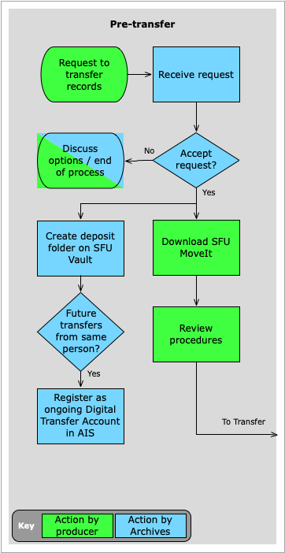
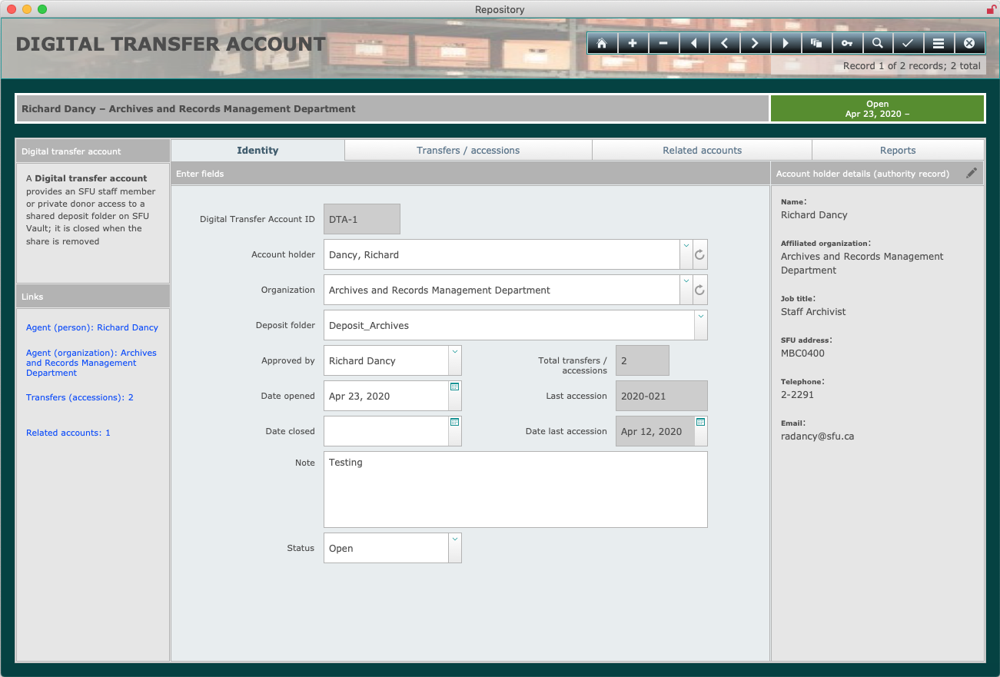

###### [Digital Transfer](../../README.md) > [Standard Transfer: Procedures for Archives](00-introduction.md)
###### 1. Pre-Transfer `|` [2. Transfer](02-transfer.md) `|` [3. Validation](03-validation.md) `|` [4. Ingest](04-ingest.md) `|` [5. Completion](05-completion.md) `|` [Appendices](../appendices/overview.md)

# 1. Pre-Transfer

The pre-transfer phase is typically triggered by the first request from a producer (SFU departmental staff or a private donor) to send digital materials to the Archives. [Determine whether or not to accept the request](#11-accept-or-reject-a-request-to-transfer). If accepted, [create a deposit folder](#12-create-a-deposit-folder) on SFU Vault. If the producer will be regularly sending new transfers in the future, you should create a [Digital Transfer Account](#13-create-a-digital-transfer-account) for the person. Once individuals have accounts, they do not need to request permission for subsequent transfers, and the transfer process more resembles a self-deposit system.

## Steps
- [1.1 Accept or reject a request to transfer](#11-accept-or-reject-a-request-to-transfer)
  - [University records](#university-records)
  - [Private records](#private-records)
  - [Checklist](#checklist)
- [1.2 Create a deposit folder](#12-create-a-deposit-folder)
  - [Guidelines](#guidelines)
  - [Shares](#shares)
- [1.3 Create a Digital Transfer Account](#13-create-a-digital-transfer-account)
  - [Who should have an account?](#who-should-have-an-account)
  - [Account creation](#account-creation)

## 1.1 Accept or reject a request to transfer
### University records
Any university department or body can transfer digital records to the Archives. But the following conditions should be met before accepting a proposed transfer:

- The person has the authority to transfer records on behalf of their unit.

- The records are covered by a [Records Retention Schedule and Disposal Authority](http://www.sfu.ca/archives2/dur/rrsdas.html) (RRSDA) whose `Final disposition` = "Archival".

- The unit is the **Office of Primary Responsibility** (OPR) for the records.

- The **total retention period** for the records has expired.

Exceptions are possible. Use your judgement and seek clarifications from the contact as required.

It is fairly common for departments to wish to transfer digital records to the Archives before their total retention period has expired. Often the applicable RRSDA was originally designed for paper records, with provision for off-site storage in the University Records Centre during the semi-active period. **There is currently no equivalent semi-active off-site storage for electronic records. All digital transfers are "archival", i.e. the records pass to the control of the Archives.**

Accepting early transfer is fine, but you should make clear to the contact that following transfer the records will no longer "belong to" the department and will now come under the custody and control of the Archives.

### Private records
Individual donors or non-SFU organizations should only transfer records when they have a **Donation Agreement** with the Archives or are in the process of negotiating one.

The following conditions should be met before accepting a proposed transfer:

- The person has the authority to transfer records on behalf of the donor.

- The records are covered by an existing Donation Agreement or negotiations for one are underway.

It is common and acceptable for donors to send materials before the Donation Agreement is finalized (e.g. so an archivist can better assess the proposed donation).

### Checklist
See the [Transfer Validation Checklist](../../downloads/checklist-validation.pdf) for more on the validation process.

## 1.2 Create a deposit folder
Under the standard transfer method, the producer will upload their transfer to a **deposit folder** on SFU Vault, the university's file-sharing and storage service. **Deposit folders should only be created on the Vault space associated with the Archives' moveit email account.**

### Guidelines
Create separate deposit folders for each fonds (1 fonds = 1 folder).

Use the following naming convention when creating deposit folders: `Deposit_<<FondsCreatorName>>`

- Prefer department or organization names over personal names when creating the folders; but for personal fonds, it is fine to use the creator's name.

- The rationale for the `Deposit_` prefix is to make it easier for depositors to understand the purpose of the folder; if the folder is shared with depositors who have SFU accounts and have installed the SFU Vault desktop app, the `Deposit_` folder will be directly accessible on their computers via Finder (Mac) or File Explorer (Windows).

### Shares
To provide the producer with access to the deposit folder, you can either (i) create a share on the folder itself; or (ii) share just a link to the folder.

- See [SFU Vault documentation](https://www.sfu.ca/itservices/collaboration/sfu-vault/faq-section/files-and-sharing/) for how to share folders by either method.

- You can only share the folder itself (method i) with someone who has an SFU email account. For non-SFU donors, share the link (method ii); it is possible to set and require a password when sharing the link.

- When you share the folder (method i) with an SFU community member and that person has installed the [desktop client version of SFU Vault](http://www.sfu.ca/download-sfuvault/), they will be able to view and interact with the deposit folder directly on their computer via Finder (Mac) or File Explorer (Windows).

- External depositors and SFU members who have not installed the desktop version of Vault will access the deposit folder through a web browser. If you shared the link (method ii), it will take them directly to the deposit folder. If you shared the folder itself (method i), they must log in with their SFU credentials at https://vault.sfu.ca and navigate to the deposit folder (e.g click the sidebar link `Shared with you`).

- By either share method, you will need to allow the depositor to have `create` privileges so that they can upload their transfer.

- For more on accessing the deposit folder from the depositor's point of view, see the [procedures for producers, section 2. Transfer](../standard-producers/02-transfer.md).

## 1.3 Create a Digital Transfer Account

For one-off transfers, the deposit folder can be deleted or the share removed after the transfer has been completed. But if the same person will be making additional transfers in the future, you can leave the deposit folder and its share in place and create a **Digital Transfer Account** for the person.

### Who should have an account?
Having a Digital Transfer Account means that a person is recognized as an authorized depositor on behalf of a fonds creator and may make transfers (deposits) without requiring preliminary permission from the Archives.

- Ideally, each university department or private donor organization that is regularly transferring digital records to the Archives should have a designated contact person who holds an account.

- There is no limit to the number of accounts per department or organization, but it is preferable to limit their number in order to centralize the transfer process for a given unit. This avoids duplication of effort, reduces the likelihood that the same materials will be sent by different people, and facilitates communication relating to transfers, holdings, retrievals, and changes to tools and processes.

### Account creation
To create an account:
- Create a deposit folder (if one does not already exist) and set up the person's share (or add their share to an existing folder).

- Register the account in the AIS database: open the **Repository module > Home > Digital Transfer Accounts** screen, click the `+ New account` button, and enter the person's data.

- For more information on data entry and management of account record in the AIS database, see the separate section on this GitHub site for AIS documentation.

###### Last updated: Jan 28, 2021
###### [< Previous: Introduction](00-introduction.md) `|` [Next: 2. Transfer >](02-transfer.md)
