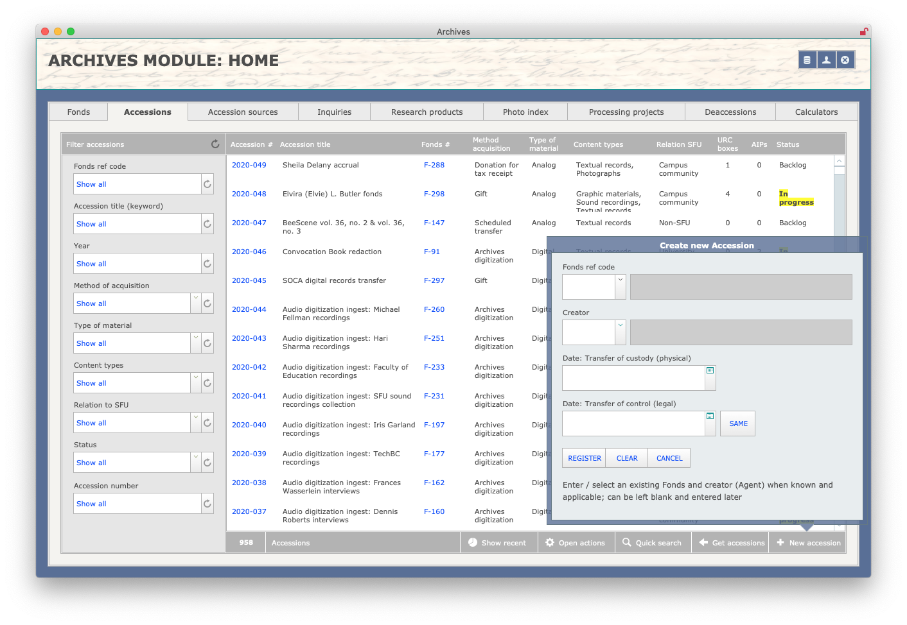

###### [Digital Transfer](../../README.md) > [Standard Transfer: Procedures for Archives](00-introduction.md)
###### [1. Pre-Transfer](01-pre-transfer.md) `|` 2. Transfer `|` [3. Validation](03-validation.md) `|` [4. Ingest](04-ingest.md) `|` [5. Completion](05-completion.md)

# 2. Transfer
###### Status: draft

The main activities in the **transfer** phase belong to the producer, who packages the files using SFU MoveIt and uploads the transfer package to the deposit folder you created previously in [step 1.2](01-pre-transfer.md#12-create-a-deposit-folder). For a description of these activities from the producer's point of view, see [Standard Transfer Method: Procedures for SFU Staff and Private Donors, section 2. Transfer](../standard-producers/02-transfer.md).

## Steps
- [2.1 Receive notice of a deposit](#21-receive-notice-of-a-deposit)
- [2.2 Create an Accession record](#22-create-an-accession-record)
- [2.3 Download the transfer package](#23-download-the-transfer-package)

## 2.1 Receive notice of a deposit
Deposit folders on SFU Vault account are configured to send activity notification emails to the `moveit` email account.
- The `moveit` account will receive an email when a producer uploads a transfer package to a deposit folder.
- The time lag between upload and email notice can be several hours.

Email notices go only to the generic `moveit` account. For individual staff to receive them, there are three options:
1. Sign in and monitor the `moveit` email account regularly (e.g. at the beginning of the day).
1. Add a share from the `moveit` account to your own email address and view the shared folders in your own account.
1. Create a redirect rule in the `moveit` account to forward a copy of all messages received by `moveit` to your own account.

For instructions, see SFU Mail documentation on [adding shares](https://www.sfu.ca/sfumail/using-sfu-mail/sharing/sharing-mail-folders.html) and [creating redirect rules](https://www.sfu.ca/sfumail/using-sfu-mail/mail/managing-mail/forward-mail-to-another-account.html).

## 2.2 Create an Accession record

Create an AIS Accession record for the transfer, if one does not already exist.
- Multiple transfer packages can be assigned to the same accession if they belong to the same transfer project.
- E.g. the person has broken up the transfer into several transfer packages deposited over several days or weeks.
- Even if the transfer is eventually rejected during the [validation stage](03-validation.md), the Accession record provides a place to document the validation decision.

To create an Accession record:
- Open the AIS `Archives module`.
- Go to the `Home` > `Accessions` tab.
- Click the `+ New accession` button.
- Enter / select the `Fonds number` and `Creator ID`.
- `Transfer of custody (physical)` = date of deposit.
- `Transfer of control (legal)` = date Donation Agreement signed (private records); leave blank if unknown; leave blank for university records.
- Click the `Register` button to create a new record and obtain the a new `Accession number` (in the form YYYY-NNN).

## 2.3 Download the transfer package
Download a copy of the transfer package from SFU Vault to your desktop for validation and analysis.
- It is possible to open and inspect the contents on SFU Vault, but the various software tools used in the [Validation phase](03-validation.md) cannot be run on Vault.

###### Last updated: Jan 6, 2021
###### [< Previous: Pre-Transfer](01-pre-transfer.md) `|` [Next: 3. Validation](03-validation.md)
