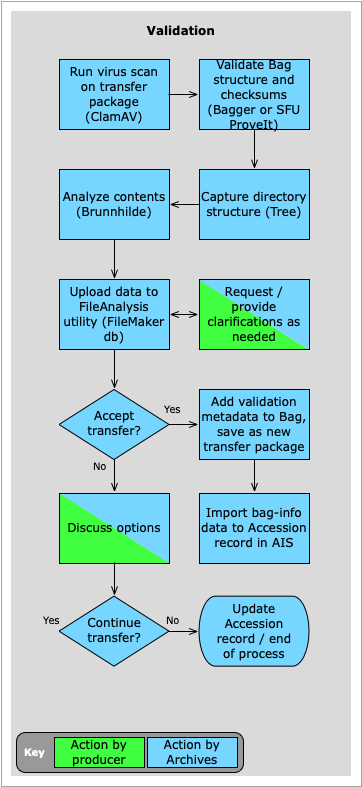
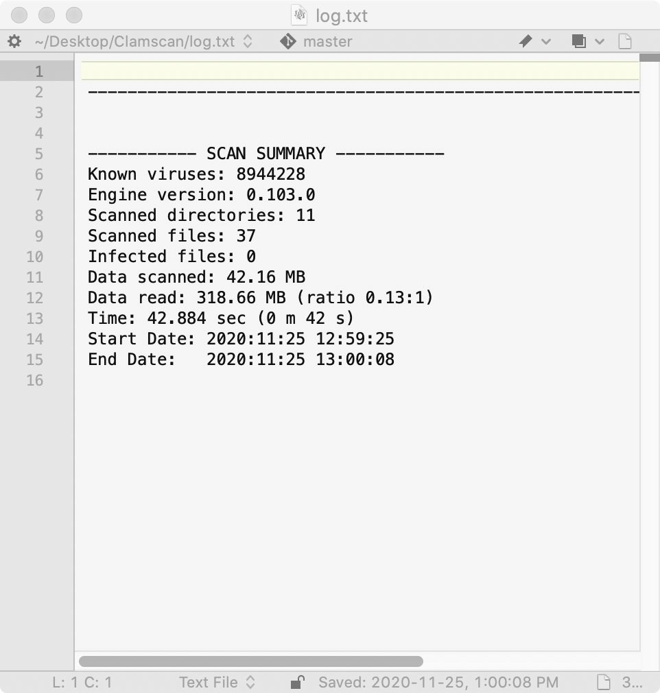
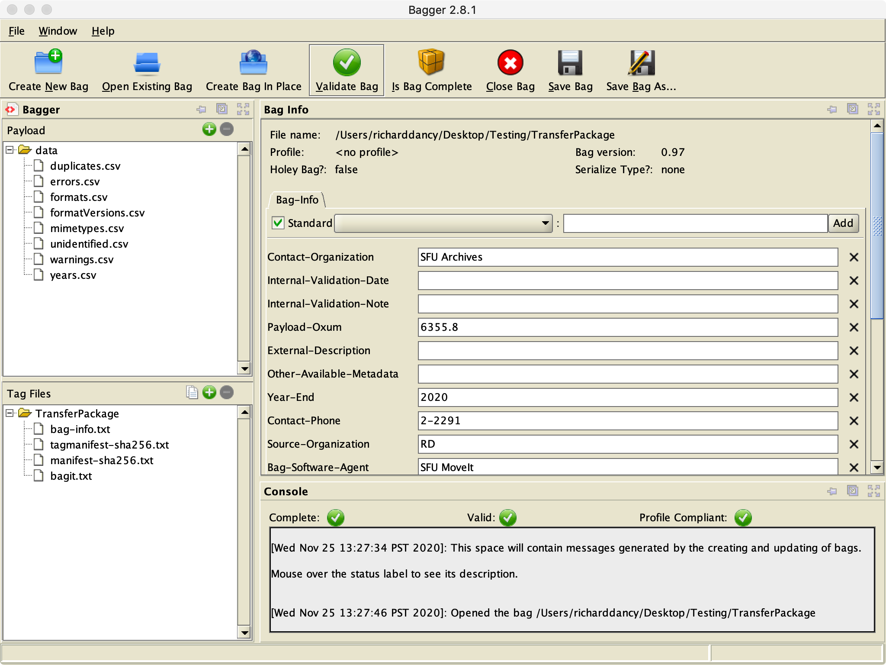
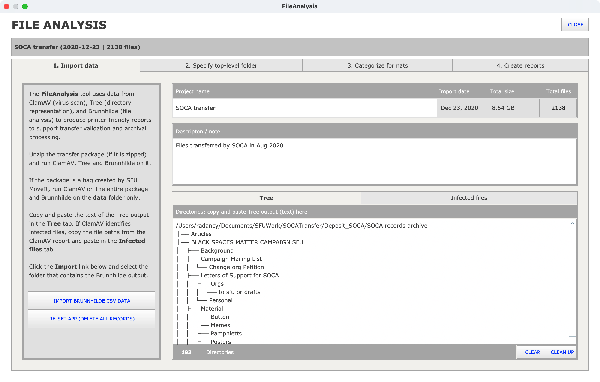
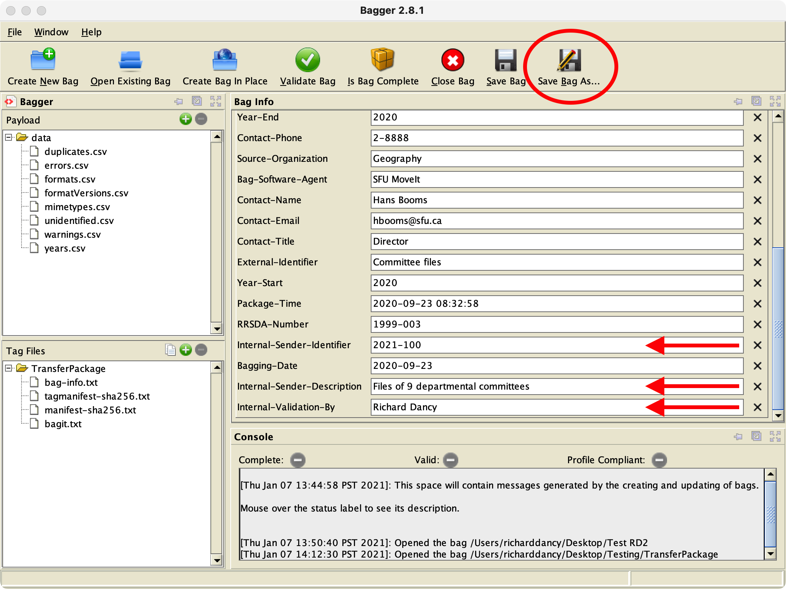

###### [Digital Transfer](../../README.md) > [Standard Transfer: Procedures for Archives](00-introduction.md)
###### [1. Pre-Transfer](01-pre-transfer.md) `|` [2. Transfer](02-transfer.md) `|` 3. Validation `|` [4. Ingest](04-ingest.md) `|` [5. Completion](05-completion.md)

# 3. Validation
###### Status: under development

Validation is the process of deciding whether or not to accept the transfer into the repository. It verifies that the transfer package complies with the BagIt specification; that no data was lost or corrupted during transmission; and that the contents meet expectations and are suitable for long-term preservation. The analysis undertaken during validation also provides descriptive data that should be captured in the Accession record for later use during arrangement and description.
- [Transfer Validation Checklist](../../downloads/checklist-validation.pdf)

## Steps
- [3.1 Scan for viruses](#31-scan-for-viruses)
- [3.2 Validate bag](#32-validate-bag)
- [3.3 Document directory structure](#33-document-directory-structure)
- [3.4 Analyze files](#34-analyze-files)
- 3.5 Create analysis reports (FileAnalysis utility)
- 3.6 Accept or reject the transfer
- 3.7 Edit / save the transfer package
- 3.8 Update the Accession record (AIS)
- [Transfer Validation Checklist](../../downloads/checklist-validation.pdf)

This phase begins after you have downloaded the transfer package to your desktop ([step 2.4](03-validation#24-download-a-copy-of-the-transfer-package)).

Before you start:
- Unzip the package.
- Create a project folder on your desktop for the various reports that will be created.

 
## 3.1 Scan for viruses

Use [ClamAV](https://github.com/SFU-Archives/digital-repository-utilities/blob/master/utilities/clamav.md) to check the transfer package for viruses and other malware. Run ClamAV via the command line in Terminal.

Refresh the virus definitions database: `$ freshclam`

Scan the transfer package: `$ clamscan -ri --log=<<log_file_path.txt>> <<transfer_folder>>`
- This will output a `scan log` text file; specify where to save it (e.g desktop project folder).
- The `scan log` will only show files that are infected, plus summary data.

If infected files are found:
- Confirm that you can safely delete the files and delete them.
- Make a note in the Accession record (e.g. in the Events section).
- Retain the `scan log` on the collection file as documentation.
- Follow up with the producer to make them aware that they have virus issues.

For more detail (installation and use) of ClamAV: [Digital Repository Utilities > ClamAV](https://github.com/SFU-Archives/digital-repository-utilities/blob/master/utilities/clamav.md).

## 3.2 Validate bag

Use Bagger to verify that the transfer package is a properly formed "bag" (complies with the BagIt specification) and that no data was lost or corrupted during the upload to the deposit folder on SFU Vault (the files' checksums match).

Open Bagger.
- Click the `Open Existing Bag` button and navigate to the (unzipped) transfer package.
- Click the `Is Bag Complete` button to verify the structure of the package; you should get an `OK` popup.
- Click the `Validate Bag` button to verify the checksums; again you should get an `OK` popup.

If the transfer package fails validation:
- Determine the reason (structure incomplete or checksum fail).
- Consult with the producer, ask them to re-package their transfer and / or re-deposit.

For more detail (installation and use) of Bagger: Digital Repository Utilities > Bagger (forthcoming).

## 3.3 Document directory structure

Use Tree to capture the original directory structure of the Transfer as a text representation. This provides an overview of the transfer and supports later appraisal, arrangement, and description.

Run Tree via the command line in Terminal: `$ tree -`

For more detail (installation and use) of Tree: [Digital Repository Utilities > Tree](https://github.com/SFU-Archives/digital-repository-utilities/blob/master/utilities/tree.md).

## 3.4 Analyze files

## 3.5 Create analysis reports

## 3.6 Accept or reject the transfer

## 3.7 Edit / save the transfer package

## 3.8 Update the Accession record

###### Last updated: Nov 24, 2020
###### [< Previous: Transfer](02-transfer.md) `|` [Next: 4. Ingest](04-ingest.md)
