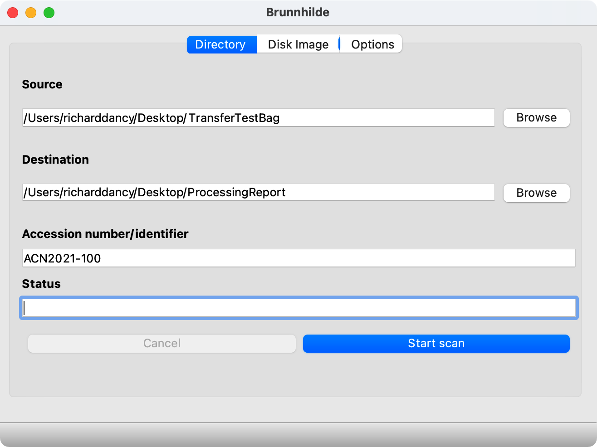
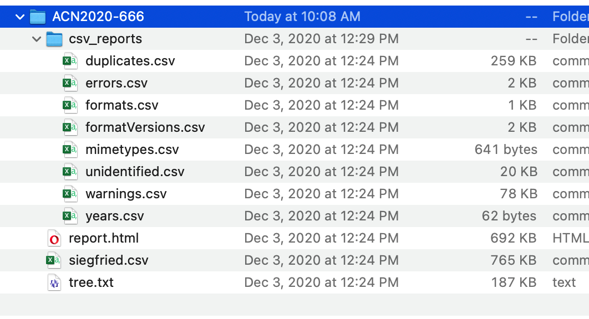
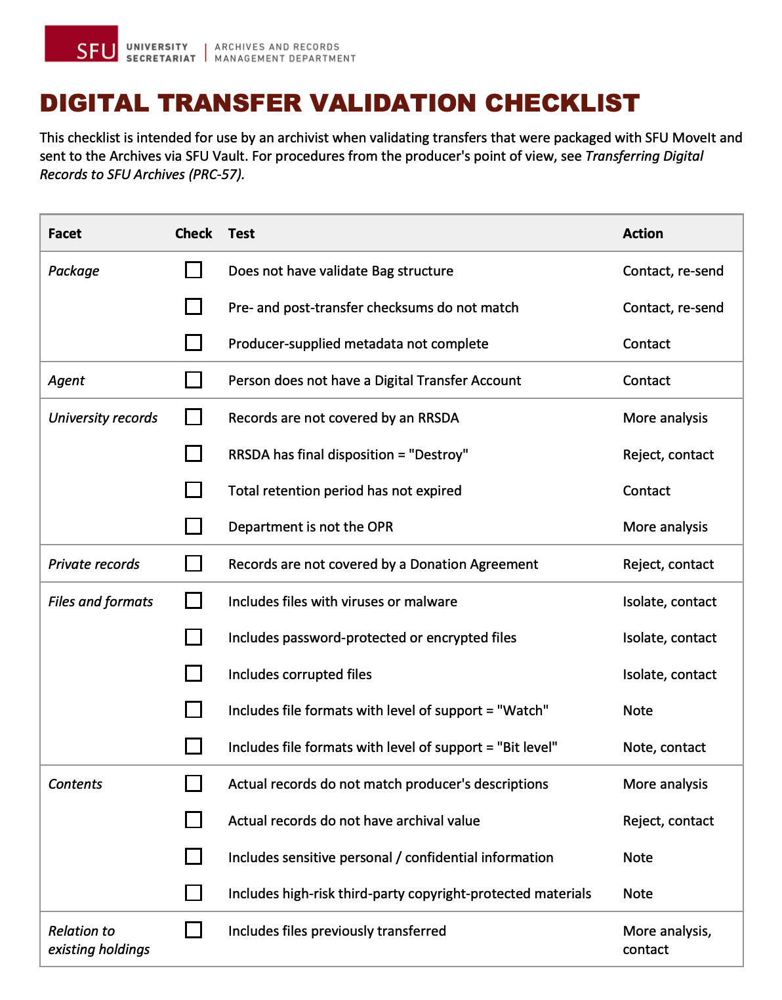

###### [Digital Transfer](../../README.md) > [Standard Transfer: Procedures for Archives](00-introduction.md)
###### [1. Pre-Transfer](01-pre-transfer.md) `|` [2. Transfer](02-transfer.md) `|` 3. Validation `|` [4. Ingest](04-ingest.md) `|` [5. Completion](05-completion.md) `|` [Appendices](../appendices/overview.md)

# 3. Validation

**Validation** is the process of deciding whether or not to accept a transfer into the repository. During this phase, you verify that the transfer package complies with the BagIt specification, that no data was lost or corrupted during transmission, and that the contents of the transfer meet expectations and are suitable for long-term preservation.

The analysis undertaken during validation also generates descriptive data that should be captured in the **Accession record** for later use during arrangement and description.

## Steps
- [3.1 Scan for viruses](#31-scan-for-viruses)
- [3.2 Validate bag](#32-validate-bag)
- [3.3 Document directory structure](#33-document-directory-structure)
- [3.4 Analyze files](#34-analyze-files)
- [3.5 Create analysis reports](#35-create-analysis-reports)
- [3.6 Accept or reject the transfer](#36-accept-or-reject-the-transfer)
- [3.7 Edit the transfer package](#37-edit-and-re-save-the-transfer-package)
- [Transfer Validation Checklist](../../downloads/checklist-validation.pdf)

This phase begins after you have downloaded the transfer package to your desktop ([step 2.3](02-transfer.md#23-download-the-transfer-package)).

Before you start:
- Unzip the package.
- Create a project folder on your desktop for the various reports that will be created.

 

## 3.1 Scan for viruses

Use [ClamAV](https://github.com/SFU-Archives/digital-repository-utilities/blob/master/utilities/clamav.md) to check the transfer package for viruses and other malware.

Run ClamAV via the command line in Terminal.
- Refresh the virus definitions database: `$ freshclam`.
- Scan the transfer package: `$ clamscan -ri --log=<<log_file_path/log.txt>> <<transfer_folder>>`.
- The `log` flag instructs `clamscan` to output a `scan log` text file to the file path specified.
- The `-r` flag = "recursive": the scan will include all sub-directories in the transfer package.
- The `-i` flag = "infected": the log will only print files that are infected, plus summary data.

If ClamAV finds infected files:
- Confirm that you can safely delete the files and delete them.
- Make a note in the Accession record (e.g. on the **Workflow > Other events** tab).
- Retain the `scan log` on the collection file as documentation.
- Follow up with the producer to make them aware that they have virus issues.

For more information (installation and use), see the [ClamAV page](https://github.com/SFU-Archives/digital-repository-utilities/blob/master/utilities/clamav.md) in the Archives' [Digital Repository Utilities site](https://github.com/SFU-Archives/digital-repository-utilities/README.md).

 

## 3.2 Validate bag

Use [Bagger](https://github.com/SFU-Archives/digital-repository-utilities/blob/master/utilities/bagger.md) to verify that the transfer package is a properly formed "bag" (complies with the [BagIt specification](https://tools.ietf.org/html/rfc8493)) and that no data was lost or corrupted during deposit (the files' pre- and post-transfer checksums match).

To launch Bagger:
- Navigate to its install location (e.g. `Applications/bagger-2.8.1`).
- In the `bin` directory, double-click the `bagger` file.
- The Bagger interface opens; you may get a warning message in Terminal, but this can be disregarded.

To validate the transfer package:
- Click the `Open Existing Bag` button and navigate to the (unzipped) transfer package.
- Click the `Is Bag Complete` button to verify the structure of the package; you should get an `OK` popup.
- Click the `Validate Bag` button to verify the checksums; again you should get an `OK` popup.

If the transfer package fails validation:
- Determine the reason (structure incomplete or checksum fail).
- Consult with the producer, ask them to re-package their transfer and / or re-deposit.

You can also use Bagger to view the descriptive metadata provided by the producer through SFU MoveIt.
- In the transfer package, this producer-supplied metadata is contained in the `bag-info.txt` file.
- This information should be reviewed when deciding to accept or reject the transfer ([see step 3.6 below](#36-accept-or-reject-the-transfer)).

For more information about installation and use, see the [Bagger page](https://github.com/SFU-Archives/digital-repository-utilities/blob/master/utilities/bagger.md) in the Archives' [Digital Repository Utilities site](https://github.com/SFU-Archives/digital-repository-utilities/README.md).

 

## 3.3 Document directory structure

Use [Tree](https://github.com/SFU-Archives/digital-repository-utilities/blob/master/utilities/tree.md) to capture the original directory structure of the transfer as a text representation. This provides a handy overview of the transfer and supports later appraisal, arrangement and description.

Run Tree via command line in Terminal: `$ tree -d -o <<file_path_for_output_report>> <<path_to_target_folder>>`
- The `-d` flag = list only directories; omit to show all contents down to the file level if desired.
- The `-o` flag = output a text report to the specified location (include the file name with `.txt` extenion, e.g. `tree.txt`).
- The easiest way to get the `<<path_to_target_folder>>` is to simply drag the transfer package into the Terminal window.

For more information (installation and use), see the [Tree page](https://github.com/SFU-Archives/digital-repository-utilities/blob/master/utilities/tree.md) in the Archives' [Digital Repository Utilities site](https://github.com/SFU-Archives/digital-repository-utilities/README.md).

 

## 3.4 Analyze files

Use [Brunnhilde](https://github.com/SFU-Archives/digital-repository-utilities/blob/master/utilities/brunnhilde.md) to generate reports that analyze the files and file formats included in the transfer.

Start Brunnhilde via the command line in Terminal: `$ python3 <<path_to_Brunnhilde_application_folder>>/main.py`
- The easiest way is to type `python3 `, then drag the `main.py` file into Terminal and hit `Return`.
- This will open the Brunnhilde interface.

In Brunnhilde:
- Make sure you **do not** run a virus scan (already done with ClamAV in [step 3.1 above](#31-scan-for-viruses)) – uncheck these boxes on the `Options` tab.
- On the **Directory** tab, click the `Browse` button to navigate to and select the transfer package as the `Source` – make sure the transfer package has been unzipped.
- Specify a project folder (e.g. on your deskotp) as the `Destination` for Brunnhilde output reports.
- Enter the `Accession number` (created in step 2.x), e.g. `ACN2021-100`; Brunnhilde will use this as the name of the folder for the output reports.
- Click the `Start scan` button: the `Status` field will show "Scan in progress."
- Depending on the size of the transfer, it may take several minutes to complete.

Brunnhilde outputs an html report and a number of csv reports to the `Destination` folder.
- Open the `report.html` file in any web browser to view all output.
- [Step 3.5 below](#35-create-analysis-reports) imports the Brunnhilde csv data into a FileMaker database to facilitate viewing and working with the data, and it will create printer-friendly reports and pdfs.

For more information (installation and use), see the [Brunnhilde page](https://github.com/SFU-Archives/digital-repository-utilities/blob/master/utilities/clamav.md) in the Archives' [Digital Repository Utilities site](https://github.com/SFU-Archives/digital-repository-utilities/README.md).

 

## 3.5 Create analysis reports

Use the [FileAnalysis utility](https://github.com/SFU-Archives/digital-repository-utilities/blob/master/utilities/clamav.md), a custom FileMaker database, to work more easily with the Brunnhilde output data.
- Download a copy of the utility to your desktop project folder from the ARMD shared drive at `ITM002-40 > ArchivalProcessingUtilities`.

Open FileAnalysis and work through the four tabs.
- The screen sidebars give more detailed instructions.
- On Tab 1 **Import data**, copy and paste Tree output ([step 3.3](#33-document-directory-structure)), copy and paste the file paths of any infected files reported by ClamAv ()[step 3.1](#31-scan-for-viruses)), then click the `Import Brunnhilde csv data` link.
- On Tab 4 **Create reports**, view summary results, navigate to the various reports on a list screen (where data can be searched or sorted), print or create pdf reports.

The data and reports are useful for getting an overview of transfer contents. You can use them to:
- View the folder directory structure.
- Get a statistical analysis of file format groups.
- Identify problematic, unexpected, or unidentified file formats.
- Get the date range of the materials based on the `Last modified` time-stamps (though you must determine whether these are reliable or not).
- Identify duplicate files included in the transfer.

This information is useful for making the validation decision ([step 3.6](#36-accept-or-reject-the-transfer)), accessioning ([step 3.8](#38-update-the-accession-record)), and later archival arrangement and description.

For more information (guidance and use), see the [File Analysis Utility page](https://github.com/SFU-Archives/digital-repository-utilities/blob/master/utilities/file-analysis-utility.md) in the Archives' [Digital Repository Utilities site](https://github.com/SFU-Archives/digital-repository-utilities/README.md).

 

## 3.6 Accept or reject the transfer

Use the [Validation checklist](../../downloads/checklist-validation.pdf) with the information you have gathered thus far to determine whether or not to accept the transfer for ingest.
- The checklist identifies various tests to apply to the transfer, and it suggests the actions you should take in the event of a fail.
- Not all (in fact very few) "fails" require you to reject a transfer outright; instead, they point to issues that may need further analysis or follow-up for clarification with the producer.

If you do reject the transfer:
- Follow up with the producer contact to explain why and what their options are.
- Update the Accession record ([step 2.2](02-transfer.md#22-create-an-accession-record)); change `Status` to "Rejected" and use the `General note` field to explain the rationale for rejection.

 

## 3.7 Edit and re-save the transfer package

If you accept the transfer ("validates successfully"), use Bagger to review / edit the metadata supplied by the producer and to add validation metadata to the transfer package. This means saving it as a new package.

To review the supplied metadata:
- Open the transfer package in Bagger ([see step 3.2 above](#32-validate-bag)).
- View / edit the fields in Bagger's `Bag Info` panel; note that fields may be displayed in random order.
- **Make sure that the information supplied is in fact correct** (e.g. `RRSDA`, `Department`); this information will stick with the transfer and will be used later to populate the AIS Accession record.

Add validation metadata in the Bagger `Bag Info` panel:
- `Internal-Sender-Identifier`: enter the Accession number in form YYYY-NNN (e.g. "2021-001"); **do not include the ACN prefix in this field.**
- `Internal-Sender-Description`: enter your own scope and content note if needed to elaborate / correct the producer's description (found in the `External-Sender-Description` field).
- `Internal-Validation-Date`: enter the date of the validation decision in form YYYY-MM-NN.
- `Internal-Validation-By`: enter the name of the archivist responsible for validation.
- `Internal-Validation-Note`: enter any information relevant to the validation decision, e.g. validation test fails and how they were handled; this field can be left blank.

Click the `Save Bag As` button to save the transfer package as a new Bag.
- In the dialog box, click the `Browse` button next to the `Save as` field to specify a new location and enter the new package name.
- Use the following naming convention: `ACN<<AccessionNumber>>_Creator_Descriptor`; e.g. `ACN2021-100_SFUGeography_CommitteeFiles`.
- Leave the `Holey bag` box unchecked.
- Set `Serial type` to "none".
- Check both `Generate ... manifest` boxes and use "SHA256" as the `manifest algorithm`.
- Click the `OK` button.

This new Bag is now the **validated transfer package** that you will upload to Archivematica in [phase 4, Ingest](04-ingest.md).

###### Last updated: Jan 28, 2021
###### [< Previous: 2. Transfer](02-transfer.md) `|` [Next: 4. Ingest >](04-ingest.md)
