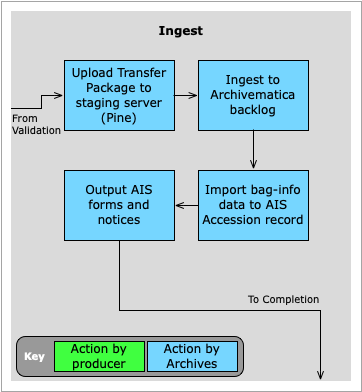
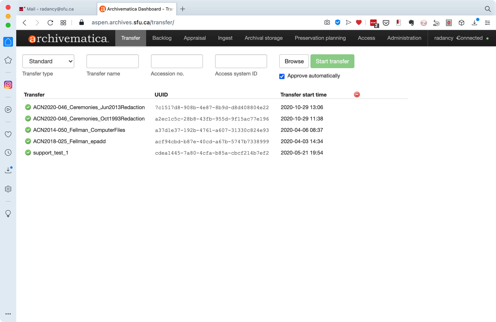
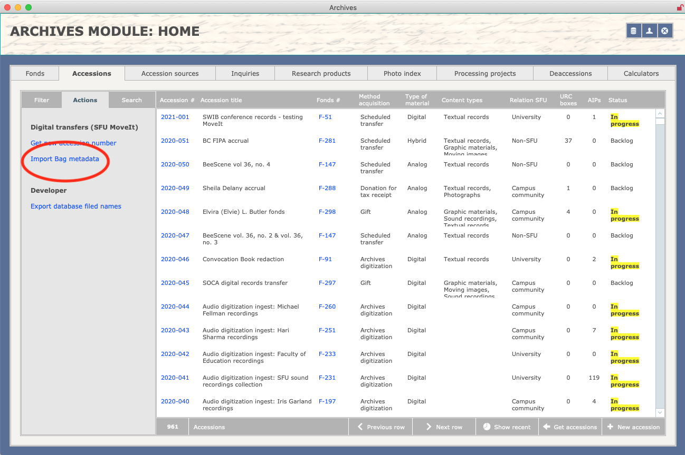
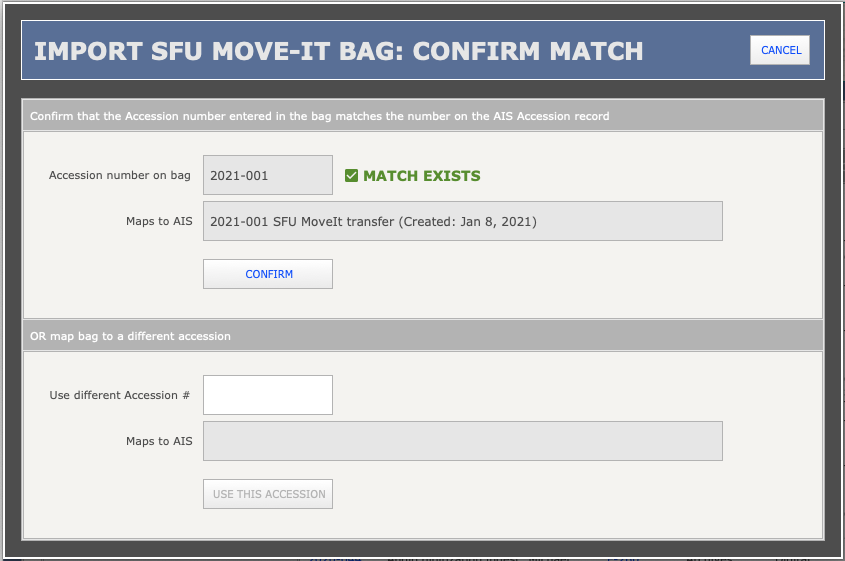
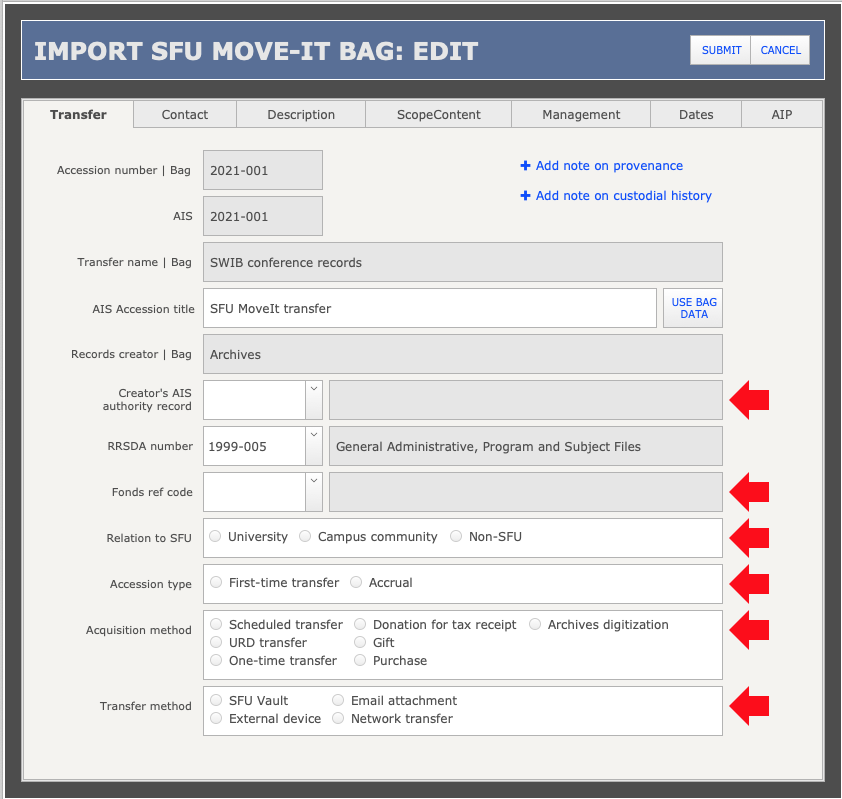
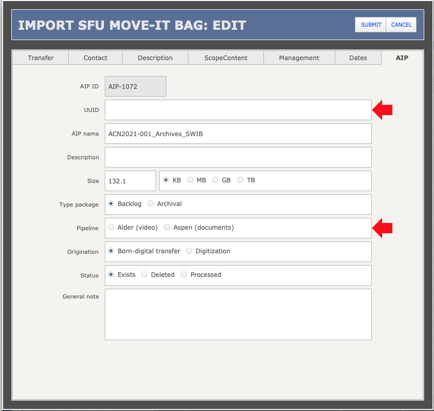
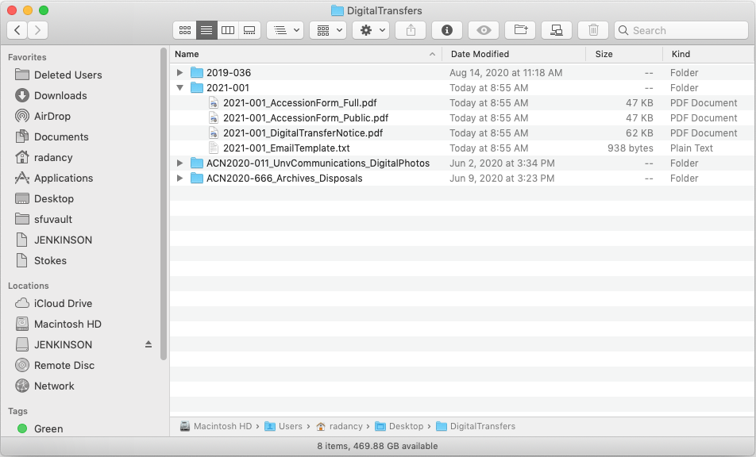

###### [Digital Transfer](../../README.md) > [Standard Transfer: Procedures for Archives](00-introduction.md)
###### [1. Pre-Transfer](01-pre-transfer.md) `|` [2. Transfer](02-transfer.md) `|` [3. Validation](03-validation.md) `|` 4. Ingest `|` [5. Completion](05-completion.md) `|` [Appendices](../appendices/overview.md)

# 4. Ingest


Ingest is the process of putting validated transfer packages into the Archives' digital repository using Archivematica. You also run AIS scripts to import metadata from the transfer's `bag-info` file to populate the Accession record and generate accession forms and notices.

## Steps
- [4.1 Upload transfer package to staging server](#41-upload-transfer-package-to-staging-server)
- [4.2 Ingest to Archivematica backlog](#42-ingest-to-archivematica-backlog)
- [4.3 Import Bag data to AIS Accession record](#43-import-bag-data-to-ais-accession-record)
- [4.4 Edit AIS accession record](#44-edit-ais-accession-record)
- [4.5 Output AIS forms and notices](#45-output-ais-forms-and-notices)

This phase begins after you have added validation metadata to the transfer package and saved it as a new Bag ([step 3.7 above](03-validation.md##37-edit-save-the-transfer-package)).

<br clear="all"/>

## 4.1 Upload transfer package to staging server
Upload the **validated transfer package** to the Archives' **Pine** VM at `/var/transfersoure`. This directory is accessed by Archivematica for ingest.

You can upload the package by various methods, but whatever you choose **must be able to preserve the original timestamps of the files**, i.e. timestamps must not be overwritten with the date / time of copying.
- The most reliable method is the command-line utility [rsync](https://github.com/SFU-Archives/digital-repository-utilities/blob/master/utilities/rsync.md), described below.
- You can use an FTP client if you can set its preferences to preserve timestamps.
- In Cyberduck, for example, go to **Preferences > Transfers > Timestamps > Uploads**; check `Preserve modification dates`.
- You can also set Cyberduck's options to verify checksums on upload, though it is not clear that this in fact happens.

By whatever method, you must have permissions to access the Archives' VMs, i.e. your email address must already be included on the mail-list that controls access.
- Consult with RD to be added to the access list.

### rsync
To run rsync via command line in Terminal:

```
$ rsync -vhrlt --progress --checksum <<file_path_to_package>> <<user>>@pine.archives.sfu.ca:/var/transfersource | tee <<path_to_output_file>>/copylist.txt
```

Note that you will be prompted to enter your SFU computing password.

Flags:
- `-v` = verbose: increases the amount of information shown about the transfer.
- `-h` = human-readable: outputs number in human-readable format.
- `-r` = recursive: copies all sub-folders and their contents.
- `-l` = symlinks: copies symlinks.
- `-t` = timestamps: preserves modification dates.
- `--progress` = shows progress in Terminal window.
- `--checksum` = uses checksums.
- `| tee` = output results to a file.

After copying is complete, connect to `pine` via Cyberduck to confirm that upload was successful and timestamps preserved.

## 4.2 Ingest to Archivematica backlog


Log on to Archivematica and ingest the transfer package to backlog.
- Use the **Aspen** pipeline for most standard transfers of textual records.
- Reserve the **Alder** pipeline for transfers of large files, e.g. typically video and audio materials.

On the Archivematica **Transfer** tab:
- Select `Transfer type` = "Unzipped bag".
- Enter the `Transfer name` using the naming convention `ACN<<AccessionNumber>>_Creator_Descriptor`, e.g. "ACN2021-100_SFUGeography_CommitteeFiles".
- The `Transfer name` should be the same as the name of the validated transfer package created in [step 3.7](03-validation.md#37-edit-the-transfer-package) above.
- Enter the `Accession number` without the "ACN" prefix, e.g. "2021-100".
- Leave `Access system ID` blank.
- Check `Automatically approve`.
- Use the `Browse` button to navigate to and select the transfer package you uploaded to `pine` at [step 4.1 above](#41-upload-transfer-package-to-staging-server); click the `Add` button.
- Click the `Start transfer` button.

As Archivematica processes the transfer, you will be prompted at three **decision-points** to select an option:
- `Perform file format identification (Transfer)` = "Yes"; select "Siegfried".
- `Examine contents` = "Yes".
- `Create SIP` = "Send to backlog".

At the end of the process, go to the Archivematica **Backlog** tab to verify completion.

Archivematica will sometimes encounter errors (and throw error messages) during processing.
- "Non-fatal" errors can stand, e.g. failure to identify the file format of a particular file; but these should be noted in the Accession record on the **Workflow > Other events** tab.
- "Fatal" errors will cause Archivematica to quit the ingest process; consult with other staff and Artefactual support as needed to resolve these on a case-by-case basis.

<br clear="all"/>

## 4.3 Import Bag data to AIS Accession record


AIS scripts can import data from transfer's `bag-info.txt` file to populate the AIS Accession record that you created previously ([step 2.2](02-transfer.md#22-create-an-accession-record)).

Before importing the Bag data, make sure that a fonds and authority record for the creator already exist in the AIS.

To launch the AIS import script:
- Open the AIS **Archives module**.
- On the **Home > Accessions > Actions** tab, click the `Import Bag metadata` link.
- You will be prompted to select a folder: **always select the top-level folder of the bag** (e.g. `ACN2021-100_SFUGeography_CommitteeFiles`).
- You can also run the script by navigating to the Accession record; on the **Reports** click the `Image SFU MoveIt bag` link.



The AIS will route you to a screen to confirm that the Accession number entered in the `bag-info` file matches an Accession record in the AIS.
- Values will mis-match if you launched the import script from the wrong Accession record in the AIS or if you entered the wrong number in Bagger when adding validation metadata to the bag ([step 3.7](#37-edit-the-transfer-package)).
- Confirm, or enter the correct `Accession number` as required.
- If you correct the `Accession number`, the import script will add that information to the Accession record's `General note` field.

Click the `Confirm` button.
- The AIS imports the bag data and routes you to a **Data Entry** screen to review / verify the data and add other descriptive information as required.

<br clear="all"/>

## 4.4 Edit AIS accession record


All fields on the **Data entry** screen that have a red arrow next to them should be completed; the rest are optional.
- Other optional note fields can be accessed by links (e.g. `+ Add note on provenance`).
- See the [AIS documentation site](https://github.com/SFU-Archives/ais-database) for guidance on all fields in AIS [Accession records](https://github.com/SFU-Archives/ais-database/blob/main/modules/archives/accession/overview.md); the following notes highlight specifics relevant to the accessioning of digital transfers.

### Transfer tab
Update the default `Accession title` ("SFU MoveIt transfer") with something more descriptive.
- To use the transfer name supplied by the contact (displayed immediately above), click the `Use bag data` button.

The shaded `Records creator` field shows the value that was supplied by the contact in the bag.
- Link the accession to the `Creator's AIS authority record` by selecting the name from the drop-down list.
- Link the accession to the creator's AIS Fonds record by selecting / entering the `Fonds reference code`.
- The authority and fonds records must already exist; if you need to create them, click the `Cancel` button, create the records, then re-run the Bag import script.

### Contact tab


The contact's information as supplied through MoveIt is displayed in the shaded fields.
- Link the accession to an existing contact by selecting their name from drop-down list in the `Contact's AIS authority ID` field.
- If the contact's supplied information (e.g. `Position / Job title` or `Email address`) differs from the information on the authority record, you can update the authority record by clicking the `Use bag data` button on any given field; but if the authority record information is more accurate, leave as is.

If there is no existing AIS authority record for the contact or the department / organization, click the `+` (Add new) button next to the drop-down list to create an authority record.

### Description tab
The `Date range` fields default to values based on the information submitted with the Bag.
- If you know it is not accurate, enter the correct data here.

The `Physical description` field defaults to the `Bag size` calculated from the actual size of the transfer.

### Scope and content tab
The `AIS scope and content` field combines the descriptive information supplied by the contact in the bag (`Producer's description`) and that added by the archivist during validation (`Archivist's description`).
- Edit as required for the Accession record.

### Management tab
Flag any known privacy, copyright, or long-term preservation issues. This tab also contains the `General note` field for information relating to the transfer that does not fit into a more specific field.

### Dates tab
These fields record dates of events in the workflow: dates of packaging and transfer (by the contact), validation and ingest (by the archivist).
- These dates will later appear in the Accession record on the **Workflow** tab (**Key dates** and **Other events** subtabs).
- The `Packaged date` is generated by SFU MoveIt on package creation.
- To set the `Transfer date` to the `Packaged date` click the `Use same` button; or enter it manually if these are known to be different.
- The `Validation` values derive from data in the validated Bag.
- The `Ingest` values default to the current date and staff name; correct if needed (the import script assumes you have already ingested the transfer to Archivematica backlog).

### AIP tab


Assuming you have already ingested the transfer to Archivematica backlog ([step 4.2 above](#42-ingest-to-archivematica-backlog)), click the `+ Register backlog package` link to create an AIP record in the AIS.
- The AIS AIP fields will appear for data entry.
- The AIS AIP table tracks Archivmatica backlog packages as well as fully processed AIPs.
- Copy / paste the package `UUID` from the Archivematica **Backlog** tab.
- The `Package name` field defaults to the name of the Bag.

### Submit data
Click the `Submit` button to complete data entry.
- A popup notice tells you the process is completed and takes you to the full Accession record.

## 4.4 Output AIS forms and notices


As part of the completion process triggered by the `Submit` button, the AIS outputs a number of files to a folder on your desktop `~/Desktop/DigitalTransfer/<<AccessionNumber>>`.

These files are:
- One pdf **Accession Record Forms** for the collection file (`_AccessionForm_Full.pdf`) and one for the **Unprocessed Holdings** tab of the hardcopy finding aid (`_AccessionForm_Public.pdf`).
- A pdf form (`_DigitalTransferNotice.pdf`) and email template text (`_EmailTemplate.txt` file) to be sent to the contact (see [step 5 below](05-completion.md)).

###### Last updated: Jan 29, 2021
###### [< Previous: 3. Validation](03-validation.md) `|` [Next: 5. Completion >](05-completion.md)
