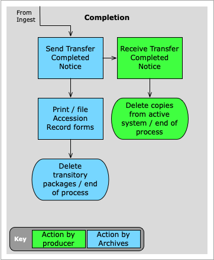
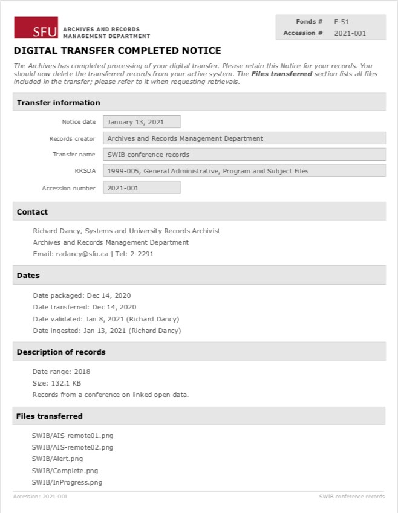

###### [Digital Transfer](../../README.md) > [Standard Transfer: Procedures for Archives](00-introduction.md)
###### [1. Pre-Transfer](01-pre-transfer.md) `|` [2. Transfer](02-transfer.md) `|` [3. Validation](03-validation.md) `|` [4. Ingest](04-ingest.md) `|` 5. Completion `|` [Appendices](../appendices/overview.md)

# 5. Completion

To complete the transfer, notify the producer contact that the transfer has been processed, file transfer documentation, and clean up (delete) transitory copies of the transfer package.

## Steps
- [5.1 Send Transfer Completed Notice](#51-send-transfer-completed-notice)
- [5.2 File transfer documentation](#52-file-transfer-documentation)
- [5.3 Delete transitory copies](#53-delete-transitory-copies)

This phase begins after you have imported Bag data to the AIS and output the various forms and notices ([step 4.4](04-ingest.md#output-ais-forms-and-notices)).

 

## 5.1 Send Transfer Completed Notice

Notify the producer contact that the transfer has been completed, using the **Digital Transfer Completed Notice** (pdf) and text template for the covering email.
- These are found in the `~/Desktop/DigitalTransfers/<<accession_number>>` folder.
- The notice includes the full list of files included in the transfer.
- The file list is generated from the Bag `manifest` file; it is not stored or retained in the AIS Accession record.

The covering email instructs the contact to delete their own copies of the files they transferred.
- This is typically appropriate for transfers of university records.
- It may or may not be appropriate for transfers of privately donated records, depending on the agreement with the donor.
- Use your judgment to customize the email message as appropriate for the given transfer.

## 5.2 File transfer documentation
File The **Accession Record Form** on the fonds collection file (full version) and the hardcopy finding aid (public verion).
- Both are in the `~/Desktop/DigitalTranfers/<<accession_number>>` folder.

File the Brunnhilde data ([validation step 3.4](03-validation.md#34-analyze-files)) and the FileMaker analysis reports [validation step 3.5](03-validation.md#35-create-analysis-reports) on the collection file (paper or electronic).
- Alternatively you can upload the reports (e.g. as a zip file) to the AIS Accession record at the **Documentation** tab.
- SFU Archives has not yet settled on how best to maintain this documentation.

File any substantive correspondence with the producer relating to the transfer (e.g. validation issues) on the collection file.

## 5.3 Delete transitory copies
Delete the various copies of the transfer package made during the transfer process:
- The copy the producer uploaded to the SFU Vault deposit folder ([step 2.1](02-transfer.md#21-receive-notice-of-a-deposit)).
- The copy you downloaded from the deposit folder for inspection and analysis ([step 2.3](02-transfer.md#23-download-the-transfer-package)).
- The validated package you made with Bagger following validation ([step 3.7](03-validation.md#37-edit-and-save-the-transfer-package)).
- The copy of the validated package you uploaded to `pine` for Archivematica ingest ([step 4.1](04-ingest.md#41-upload-transfer-package-to-staging-server)).

On Archivematica delete the job entries from the **Transfer** and **Ingest** tabs.

###### Last updated: Jan 29, 2021
###### [< Previous: 4. Ingest](04-ingest.md)
