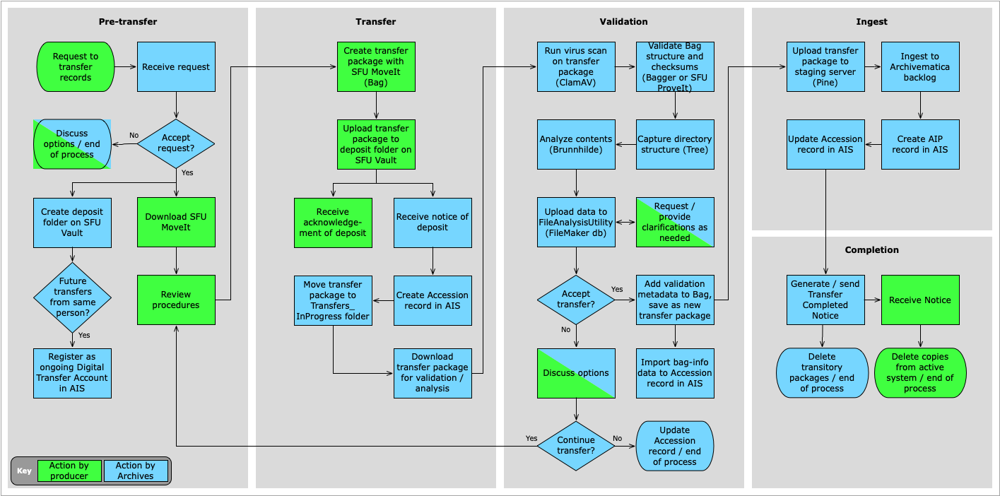

###### [Digital Transfer](../../README.md) > Standard Transfer: Procedures for Producers
###### [1. Pre-Transfer](01-pre-transfer.md) `|` [2. Transfer](02-transfer.md) `|` [3. Validation / Ingest](03-validation-ingest.md) `|` [4. Completion](04-completion.md)

# Standard Transfer: Procedures for Producers
###### Status: under development
These procedures are written for SFU staff and private donors ("producers") who wish to transfer their digital records to the Archives. In the workflow diagram below, actions and decision points by producers are shaded green.

For the same process from the Archives point of view, see [Standard Transfer Method: Procedures for Archives](../standard-archives/00-introduction.md).

[1. Pre-transfer](01-pre-transfer.md)
- [1.1 Request a deposit folder](01-pre-transfer.md#11-request-a-deposit-folder)
- [1.2 Download SFU MoveIt](01-pre-transfer.md#12-download-sfu-moveit)
- [1.3 Request an ongoing Digital Transfer Account](01-pre-transfer.md#13-request-an-ongoing-digital-transfer-account)

[2. Transfer](02-transfer.md)
- [2.1 Identify records for transfer](02-transfer.md#21-identify-records-for-transfer)
- [2.2 Create transfer folder(s)](02-transfer.md#22-create-transfer-folders)
- [2.3 Create a transfer package with SFU MoveIt](02-transfer.md#23-create-a-transfer-package-with-sfu-moveit)
- [2.4 Upload the transfer package to SFU Vault](02-transfer.md#24-upload-the-transfer-package-to-sfu-vault)
- [Transfer Checklist](../../downloads/checklist-transfer.pdf)

[3. Validation and Ingest](03-validation-and-ingest.md)
- [3.1 Validation](#31-validation)
- [3.2 Ingest](#32-ingest)

[4. Completion](04-completion.md)
- [4.1 Receive completion notice](04-completion.md#41-receive-completion-notice)
- [4.2 Delete transferred records](04-completion.md#42-delete-transferred-records)

**Appendices**
- [A. Transfer Metadata](../appendices/a-transfer-metadata.md)
- [B. Anatomy of the Transfer Package](../appendices/b-anatomy-transfer-package.md)
- [C. Post-transfer](../appendices/c-post-transfer.md)

###### Last updated: Jan 22, 2021
###### [Next: 1. Pre-transfer >](01-pre-transfer.md)
