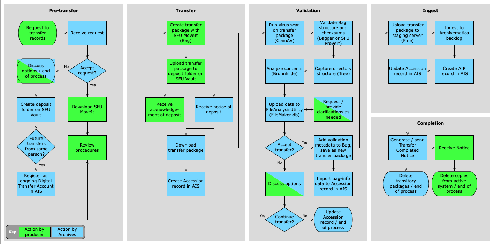

###### [Digital Transfer](../../README.md) > Standard Transfer: Procedures for Produceers
###### [1. Pre-Transfer](01-pre-transfer.md) `|` [2. Transfer](02-transfer.md) `|` [3. Validation](03-validation.md) `|` [4. Ingest](04-ingest.md) `|` [5. Completion](05-completion.md)

# Standard Transfer Method: Procedures for SFU Staff and Private Donors
###### Status: under development
These procedures are written for SFU staff and private donors ("producers") who wish to transfer their digital records to the Archives. In the workflow diagram below, actions and decision points by producers are shaded green.

For the same process from the Archives point of view, see [Standard Transfer Method: Procedures for Archives](../standard-archives/00-introduction.md).

[1. Pre-transfer](01-pre-transfer.md)
- 1.1 Request to make a transfer
- 1.2 Download and install SFU MoveIt
- 1.3 Obtain an ongoing Digital Transfer Account

[2. Transfer](02-transfer.md)
- 2.1 Identify records for transfer
- 2.2 Create transfer folder(s)
- 2.3 Create transfer packages with SFU MoveIt
- 2.4 Upload transfer packages to SFU Vault
- [Transfer Checklist][../../downloads/checklist-transfer.pdf]

[3. Validation and Ingest](03-validation-and-ingest.md)
- 3.1 Provide clarifications as required
- 3.2 Receive notice of validation decision

[4. Completion](04-completion.md)
- 4.1 Receive notice of completion of transfer
- 4.2 Delete copies from active system

[5. Post-transfer](05-post-transfer.md)
- 5.1 Maintain record of transfers
- 5.2 Request retrieval

###### Last updated: Nov 18, 2020
