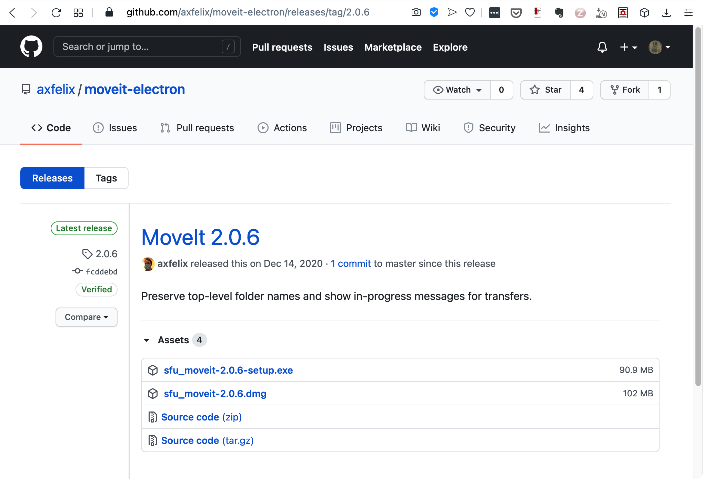

###### [Digital Transfer](../../README.md) > Standard Transfer: Procedures for Producers
###### 1. Pre-Transfer `|` [2. Transfer](02-transfer.md) `|` [3. Validation / Ingest](03-validation-ingest.md) `|` [4. Completion](04-completion.md) `|` [5. Post-transfer](05-post-transfer.md)

# 1. Pre-transfer
###### Status: draft

Before you make your first transfer, contact the Archives to [request access to a deposit folder](#11-request-access-to-a-deposit-folder) the Archives must create for you on SFU Vault. You will also need to [download SFU MoveIt](#12-download-sfu-moveit), the Archives' digital packaging tool. If you will be making regular digital transfers, [request a Digital Transfer Account](#13-request-an-onging-digital-transfer-account) as this will provide you with continuing access to a deposit folder.

## Steps
- [1.1 Request access to a deposit folder](#11-request-access-to-a-deposit-folder)
- [1.2 Download SFU MoveIt](#12-download-sfu-moveit)
- [1.3 Request an ongoing Digital Transfer Account](#13-request-an-ongoing-digital-transfer-account)

## 1.1 Request access to a deposit folder
Contact the Archives directly (tel. 2-2380 or email archives@sfu.ca or moveit@sfu.ca) to request a deposit folder.

Note that the Archives tries to limit the number of transfer contacts per department or organization in order to centralize the transfer process for a given unit.
- This is to avoid duplication of effort, reduce the likelihood that the same materials will be sent by different people, and facilitate communications relating to transfers, holdings, retrievals, and changes to tools and processes.

On approval, the Archives creates a deposit folder on its space in SFU Vault and sends you a confirmation email that includes:
- The name of your deposit folder (typically `Deposit_DeptOrgName`).
- A link to the folder on SFU Vault.

## 1.2 Download SFU MoveIt

SFU MoveIt is a small, open-source desktop utility for packaging digital materials as standardized containers ("bags") that follow the [BagIt File Packaging Format](https://tools.ietf.org/html/rfc8493). It was developed by Alex Garnett, SFU Research Data Management & Systems Librarian.
- For more information about the app, see the [SFU MoveIt page on the Archives' website](https://www.sfu.ca/archives/digital-preservation/sfu-moveit.html).

To download:
- Go to the developer's [GitHub download page for the latest release](https://github.com/axfelix/moveit-electron/releases/tag/2.0.6).
- Select the version for your operating system: MacOS = the `dmg` file, Windows = the `exe` file.
- When download is complete, double-click the `dmg` or `exe` file and move the application icon to a location on your computer.
- The app can be stored and run from any location on your machine, but Archives recommends storing in your standard `Applications` folder (Mac) or `Programs` folder (Windows).

### Security warnings
Note that you may get security warnings when you first open the app.
- The Mac version is an Apple "signed" or certified app, but the first time you open it you may be prompted to confirm permission.
- With the Windows version, you may have to click through several security warnings to open the application the first time.

### Uninstall
To uninstall SFU MoveIt, simply drag the application icon to the trash/recycle bin.

 

## 1.3 Request an ongoing Digital Transfer Account
With a one-off transfer, your access to the deposit folder will expire after the transfer is complete. If you will be regularly transferring digital records to the Archives, you should request an ongoing **Digital Transfer Account**. This provides you with continuing access to the deposit folder.

Request an account by contact the Archives directly or by completing and submitting the [online request form on the Archives website at the Digital Preservation > Digital transfer account page](https://www.sfu.ca/archives/digital-preservation/digital-transfer-account.html).

On approval, you will no longer be required to contact the Archives in advance of a transfer, you simply access the deposit folder as needed.
- If you have an SFU email address, the Archives can set up a share for you on the deposit folder.
- If you install the SFU Vault desktop application on your computer, the shared deposit folder (typically named `Deposit_DeptOrgName`) will appear as a folder in your local file directory and syncs with the remote folder on Vault.
- For more information on SFU Vault, see the [help and information pages maintained by SFU IT Services](https://www.sfu.ca/itservices/collaboration/sfu-vault.html).

###### Last updated: Jan 19, 2021
###### [< Previous: Introduction](00-introduction.md) | [Next: 2. Transfer >](02-transfer.md)
