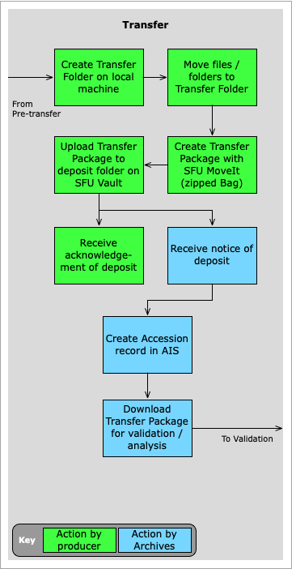
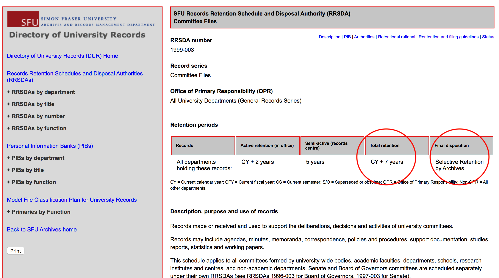
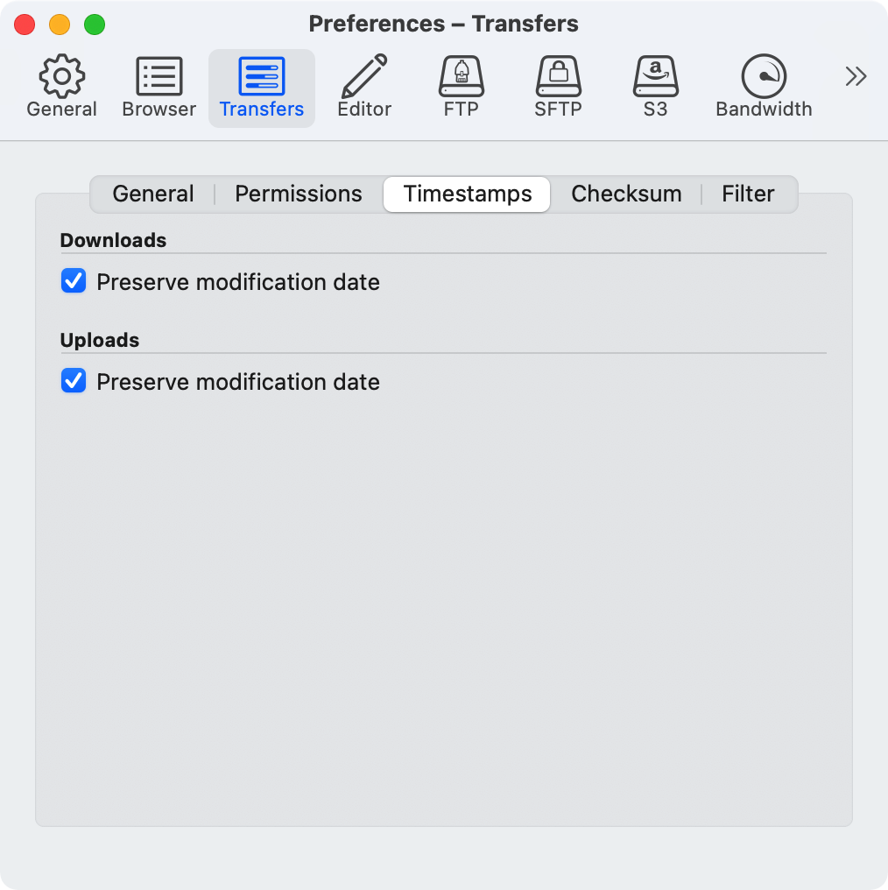

###### [Digital Transfer](../../README.md) > [Standard Transfer: Procedures for Producers](00-introduction.md)
###### [1. Pre-Transfer](01-pre-transfer.md) `|` 2. Transfer `|` [3. Validation / Ingest](03-validation-ingest.md) `|` [4. Completion](04-completion.md) `|` [5. Post-transfer](05-post-transfer.md)

# 1. Transfer
###### Status: draft

The **transfer phase** begins when you are ready to send digital records to the Archives. You [identify](#21-identify-records-for-transfer) and [gather the records](#22-create-transfer-folders) for transfer, [package them with SFU MoveIt](#23-create-a-transfer-package-with-sfu-moveit), and [upload the transfer package](#24-upload-the-transfer-package-to-sfu-vault) to the deposit folder on SFU Vault. For a handy overview / reminder of the steps, download the [Transfer Checklist (pdf)](../../downloads/checklist-transfer.pdf).

## Steps
- [2.1 Identify records for transfer](#21-identify-records-for-transfer)
    - [SFU departments](#sfu-departments)
    - [Private donors](#private-donors)
    - [File formats](#file-formats)
- [2.2 Create transfer folder(s)](#22-create-transfer-folders)
    - [Transfer folder](#transfer-folders)
    - [Passwords and encryption](#passwords-and-encryption)
    - [How many transfer folders?](#how-many-transfer-folders)
    - [Large transfers](#large-transfers)
- [2.3 Create a transfer package with SFU MoveIt](#23-create-a-transfer-package-with-sfu-moveit)
- [2.4 Upload the transfer package to SFU Vault](#24-upload-the-transfer-package-to-sfu-vault)
    - [SFU Vault desktop version](#sfu-vault-desktop-version)
    - [SFU Vault web version with transfer account](#sfu-vault-web-version-with-transfer-account)
    - [SFU Vault web version with no transfer account](#sfu-vault-web-version-with-no-transfer-account)
    - [Notification](#notification)
- [Transfer Checklist](../../downloads/checklist-transfer.pdf)

## 2.1 Identify records for transfer
Not all digital records can or should be transferred to the Archives for permanent preservation. Consider the following factors when determining which records are suitable for transfer.

### SFU departments

Determine whether there is a **Records Retention Schedule and Disposal Authority** (RRSDA) that applies to the records.
- University records can only be transferred to Archives if there is an existing RRSDA that applies to them; for a list of all RRSDAs, see the online [Directory of University Records (DUR)](http://www.sfu.ca/archives2/dur/rrsdas.html).
- Your records may not be eligible for transfer if your department is not the Office of Primary Responsibility (OPR) for them; i.e. your records are copies of the authoritative records that will be transferred by another department.
- Your records will not be eligible for transfer if they are scheduled for destruction and should be destroyed, not transferred, at the end of the retention period.

Determine whether the total retention period has expired.
- Digital records should normally be sent to Archives only after the expiry of the total retention period set out in the RRSDA (= **active** + **semi-active** retention periods).
- This differs from the situation with paper records, which may be sent to the University Records Centre (URC) for offsite storage at the end of their active retention period.
- The Archives does not currently provide semi-active storage for digital records.
- In some circumstances the Archives will accept digital records before their semi-active expiry date, but it will treat them as archival in those cases (i.e. fully under the control of the Archives rather than the department). Requests are handled on a case-by-case basis in consultation with the department.

### Private donors
Determine whether there is an existing Donation Agreement that covers the records.
- All private donations must be negotiated with SFU Archives and the terms and conditions set out in a signed Donation Agreement before the records can be transferred.
- Consult the [Donor resources section](https://www.sfu.ca/archives/resources/donor-resources.html) of the Archives' website or contact an archivist for more information about donating materials to SFU Archives.

### File formats
Be aware of the files formats of the materials you are transferring and whether or not they are currently supported by the Archives' preservation program.

In order to ensure the long-term accessibility of digital objects, the Archives develops a preservation and access plan for each file format we take in; these plans are embodied in the [Format Policy Registry (FPR)](https://www.sfu.ca/content/dam/sfu/archives/PDFs/DigitalPreservation/LinksResources/FormatPolicyRegistry.pdf), along with recommendations for **Preferred** or **Acceptable** formats.
- If the file formats you wish to transfer are not on the FPR or appear there under `Level of support` as "Watch" or "Bit-level" it means that the Archives cannot presently guarantee that files in those formats will continue to be accessible (renderable) into the future.
- You can still transfer non-preferred formats, but you should consult with an SFU archivist to discuss the implications. See also the Explanations section of the FPR for more detail.

## 2.2 Create transfer folder(s)
Gather the materials for transfer.

### Transfer folder

Create a transfer folder on your local machine to collect all files you will be transferring.
- This step segregates the material for transfer from other records that will remain in your active system: this will facilitate their eventual deletion at the end of the transfer process.

When moving folders and files **it is critical not to overwrite the timestamps for the dates of file creation and modification**.
- The `modified date` of a file provides useful contextual information that should be preserved.
- If you copy files from an external server or hard drive onto your computer, `created` and `modified` dates will likely be overwritten with the date of the copying (from the standpoint of your computer, this is now the date of creation).
- To avoid this, use an FTP client (e.g. Cyberduck) to move files; change the settings in the app's preferences so that it preserves timestamps.
- In Cyberduck for example, you do this by navigating to `Preferences > Transfers > Timestamps` and checking the box `Preserve modification dates` for both uploads and downloads.

All materials for a single transfer must be placed inside one folder.
- When packaging materials with SFU MoveIt (in [step 2.3 below](#23-create-a-transfer-package-with-sfu-moveit)), you will be prompted to select a folder (not an individual file), and you can only select one folder (rather than make multiple selections).
- It is fine to include sub-folders in the transfer folder.
- When grouping materials into a single folder, leave files nested in their original folder / sub-folder hierarchies whenever possible.
- The original directory structure conveys important context for the files and it will be lost if the directory is arbitrarily flattened out.

### Passwords and encryption
Remove any passwords or encryption on files before transfer.
- Password-protected or encrypted files will be inaccessible in the future without the password or encryption key.
- The Archives' preservation system is not set up to manage password-protection on individual documents.
- If there are reasons for restricting access to files, communicate this directly to the archivist; the Archives can manage access restrictions without password-protecting individual documents.

### How many transfer folders?
Determine the number of transfer folders / packages you will need.
- You can structure your transfer as one large package or break it down into as many separate packages as you like.

There are a number of situations in which you might want to create multiple transfer packages. For example when:
- You are working on a transfer project on and off over several weeks and you want to push things out as you go.
- Different persons are responsible for different parts of the transfer.
- Different retention schedules (RRSDAs) apply to different parts of the transfer; materials covered by different RRSDAs must be packaged separately (1 RRSDA = 1 transfer folder).
- File sizes are very large (e.g. audio and video materials) and you want to break up the transfer into several parts.

### Large transfers
In general it is fine to use SFU MoveIt to create large packages (up to 10 GB) and upload them to SFU Vault. But the larger the transfer package, the greater the processing time for packaging (for SFU MoveIt) and the longer the upload time (for SFU Vault).
- A single transfer folder cannot exceed 10 GB.
- **For optimum processing and upload speeds, we advise keeping folder size to under 2 GB.**

It will not always be feasible to keep transfer folder size below these thresholds, e.g. if you are transferring audio-visual materials.
- You should still package the materials with SFU MoveIt as described in the next section, but there may be alternatives transfer methods (e.g. copy to an external drive for pick-up or delivery), rather than upload to SFU Vault.
- Consult with an archivist about the best transfer method for packages larger than 2 GB.

## 2.3 Create a transfer package with SFU MoveIt

Use SFU MoveIt to create the transfer package.
- Double-click the `sfu-moveit` application icon to open the utility.

Enter information about the transfer in the fields provided.
- [Appendix A, Transfer metadata](appendix#a-transfer-metadata) describes fields in more detail.
- Note that your contact information will default to whatever values were entered in your previous session.

Click the `Create Transfer Package` button.
- You will be prompted to select the target transfer folder.
- You can only select one transfer folder per package (but there is no limit to the number of sub-folders it may contain); see the section above on [How many transfer folders?](#how-many-transfer-folders).

SFU MoveIt will display a notification message when it has completed packaging.
- Find the transfer package on your desktop as a single zip file.
- The name of the zip file is based on the data your entered as the `Transfer title`.
- [Appendix B, Anatomy of the transfer package](appendix/#b-anatomy-of-the-transfer-package) provides more information about the transfer package and its structure.
- Note that the transfer package is a **copy** of the target transfer folder; the original folder and files are left in place.

## 2.4 Upload the transfer package to SFU Vault

Upload the transfer package (zip file) to the deposit folder you were assigned in step 1.1 above ([Request a deposit folder](01-pre-transfer.md#11-request-a-deposit-folder)).
- The deposit folder is typically named `Deposit_DeptOrganizationName`.

### SFU Vault desktop version
If you have a [Digital Transfer Account](01-pre-transfer.md#13-request-an-ongoing-digital-transfer-account) and you have installed the desktop version of SFU Vault, the deposit folder should appear in the directory system on your local computer (accessible via Windows File Explorer or Mac Finder).

Drag the transfer package to the deposit folder.
- The application will synchronize your local folder with the deposit folder on Vault.
- Depending on the size of the file, the sync operation may take some time.
- Note that SFU Vault may turn off synchronization for very large files; you should be able to override this and manually start the sync.
- For troubleshooting consult the [SFU Vault help pages](https://www.sfu.ca/itservices/collaboration/sfu-vault.html) maintained by ITS.

### SFU Vault web version with transfer account
If you have a [Digital Transfer Account](01-pre-transfer.md#13-request-an-ongoing-digital-transfer-account) but you have not installed the desktop version of SFU Vault, access your deposit folder via your web browser.

Open the url [https://vault.sfu.ca].
- Enter your SFU computing credentials (account name and password).
- In the sidebar along the left, click the `Shared with you` link.
- Click the deposit folder that will appear in the list.
- Drag the transfer package to the folder or use the upload icon.
- Upload may take some time for large file sizes.
- Archives recommends keeping transfers to under 2 GB per package; up to 10 GB is possible, but upload times will be long (see the discussion above, [How many transfer folders?](#how-many-transfer-folders).

### SFU Vault web version with no transfer account
If you not have a [Digital Transfer Account](01-pre-transfer.md#13-request-an-ongoing-digital-transfer-account), access your one-time deposit folder via your web browser.
- Open the url link you received from the Archives in [step 1.1 above](01-pre-transfer.md#11-request-a-deposit-folder).
- Drag the zip file to the folder or use the upload icon to copy the transfer packager to the deposit folder.
- See the [note above](#sfu-vault-web-version-with-transfer-account) for large file sizes.

### Notification
An archivist will send you an email confirming receipt of your transfer.
- The Archives receives automatic notification from SFU Vault whenever new files have been added to a deposit folder, but there can be a time lag.
- **If you do not receive a confirmation email within several days of your deposit, please email the Archives directly (moveit@sfu.ca)** it may indicate problems with the automated notice system.

###### Last updated: Jan 20, 2021
###### [< Previous: 1. Pre-transfer](01-pre-transfer.md) | [Next: 3. Validation / Ingest >](03-validation-ingest.md)
