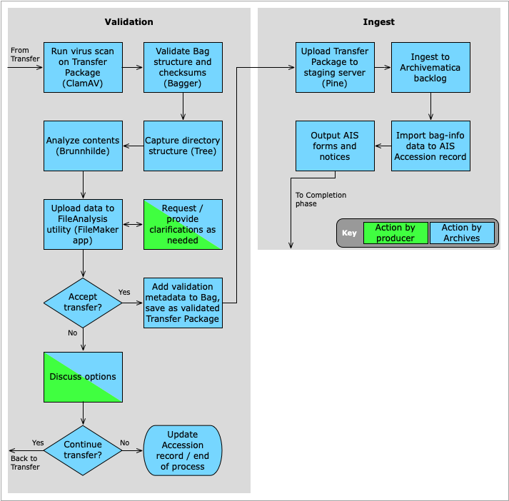

###### [Digital Transfer](../../README.md) > [Standard Transfer: Procedures for Producers](00-introduction.md)
###### [1. Pre-Transfer](01-pre-transfer.md) `|` [2. Transfer](02-transfer.md) `|` 3. Validation / Ingest `|` [4. Completion](04-completion.md)

# 3. Validation and ingest
###### Status: draft

[Validation](#31-validation) and [ingest](#32-ingest) are operations done by Archives and typically do not require any action on the part of producers. Archives may, however, contact you during these phases to request clarifications or in the event that there are problems with the transfer. For more information about these processes, see the point-of-view procedures for archivists, step 3 ([validation](../standard-archives/03-validation.md)) and step 4 ([ingest](../standard-archives/04-ingest.md)).

## Steps
- [3.1 Validation](#31-validation)
- [3.2 Ingest](#32-ingest)

##  3.1 Validation
**Validation** is the processing of determining whether or not to accept a transfer. It answers two questions:
1. Was the transmission of data successful? Yes = no data was lost or corrupted during upload.
1. Are the contents of the transfer acceptable for permanent preservation in the Archives? Yes = the records have enduring archival value.

To validate data transmission, the Archives uses a tool called [Bagger](https://github.com/SFU-Archives/digital-repository-utilities/blob/master/utilities/bagger.md) to compare pre- and post-transfer checksums on each file to verify data integrity. The Archives also runs a virus scan during this stage to identify any infected files or malware.
- For more information about checksums, see [Appendix B, Anatomy of the Transfer Package](../appendices/b-anatomy-transfer-pacakge.md#checksums).

To validate the contents of the transfer, an archivist will typically inspect and review the files themselves (or at least a sample). There are various reasons the Archives may reject a transfer on the basis of its contents. For example:
- The records do not match the description (e.g. they are described as "committee records" but are in fact financial receipts).
- The records are scheduled for destruction rather than archival transfer.
- The records were already previously transferred.
- The files are encrypted or password-protected.
- See the discussion in [section 2.1](02-transfer.md#21-identify-records-for-transfer) above for more information about records that are suitable or not suitable for archival transfer.

**The Archives will never simply reject a transfer without first contacting the sender to request clarification, explain our reasoning, or discuss options.**

## 3.2 Ingest
Ingest is the process of committing your transfer to the Archives' digital repository for long-term preservation. An archivist registers the transfer as an **Accession**, assigns it a unique accession number, and processes the transfer through Archivematica, the Archives' digital preservation software.

Archivematica runs a number of actions on the files. Among other things, it:
- Extracts any packages included in the transfer (e.g. uncompresses zip files).
- Assigns a unique ID to each digital object.
- Creates or checks previously created checksums for each object.
- Sanitizes file names (removes any special characters that may cause problems).
- Identifies file formats.
- Extracts technical metadata.

Metadata and a log of all actions are structured according to the [PREMIS data standard](https://www.loc.gov/standards/premis/) and written to a [METS file](http://www.loc.gov/standards/mets/) added to the transfer package. At the end of this process, the package is moved to disk space in the **Backlog storage** component of the Archives' digital repository.
- The Archives' storage spaces are provisioned and backed up by the university's [IT Services department](https://www.sfu.ca/itservices.html).

###### Last updated: Jan 22, 2021
###### [< Previous: 2. Transfer](02-transfer.md) | [Next: 4. Completion >](04-completion.md)
