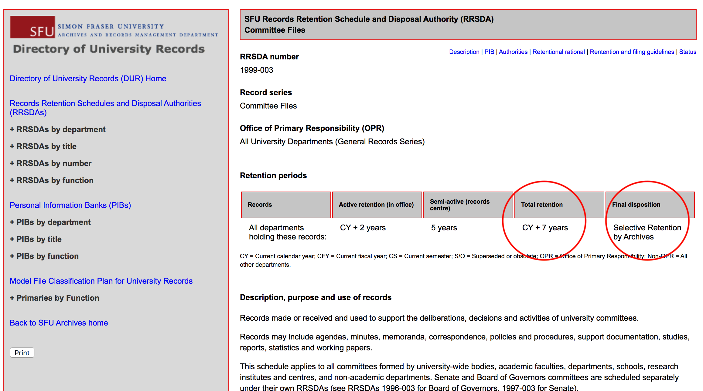

###### [Digital Transfer](../README.md) `|` [Procedures for Producers](procedures.md) `|` [FAQs](faqs.md)
###### Transfer

# What Records Can I Transfer?
Not all digital records can or should be transferred to the Archives for permanent preservation. Consider the following factors when identifying records that are suitable for transfer.

## SFU departments

Determine whether there is a **Records Retention Schedule and Disposal Authority** (RRSDA) that applies to the records.
- University records can only be transferred to Archives if there is an existing RRSDA that applies to them; for a list of all RRSDAs, see the online [Directory of University Records (DUR)](http://www.sfu.ca/archives2/dur/rrsdas.html).
- Your records may not be eligible for transfer if your department is not the Office of Primary Responsibility (OPR) for them; i.e. your records are copies of the authoritative records that will be transferred by another department.

Confirm that the RRSDA's "final disposition" is **archival**.
- Your records will not be eligible for transfer if they are scheduled for destruction and should be destroyed, not transferred, at the end of the retention period.

Determine whether the total retention period has expired.
- Digital records should normally be sent to Archives only after the expiry of the total retention period set out in the RRSDA (= **active** + **semi-active** retention periods).
- This differs from the situation with paper records, which may be sent to the University Records Centre (URC) for **semi-active** offsite storage at the end of their **active** retention period.
- The Archives does not currently provide semi-active storage for digital records.

In some circumstances the Archives will accept digital records before their semi-active expiry date.
- In those cases, the Archives will treat the records as **archival**, i.e. fully under the control of the Archives rather than the department.
- Requests are handled on a case-by-case basis in consultation with the department.

## Personal archives and non-SFU records
Determine whether there is an existing Donation Agreement that covers the records.
- All private donations must be negotiated with SFU Archives and the terms and conditions set out in a signed Donation Agreement before the records can be transferred.
- Consult the [Donor resources section](https://www.sfu.ca/archives/resources/donor-resources.html) of the Archives' website or contact an archivist for more information about donating materials to SFU Archives.

## File formats
You should be aware of the file formats of the records you are transferring and whether or not those formats are currently supported by the Archives' preservation program.

In order to ensure the long-term accessibility of digital materials, the Archives develops a preservation and access plan for each file format we take in; these plans are embodied in the [Format Policy Registry (FPR)](https://www.sfu.ca/content/dam/sfu/archives/PDFs/DigitalPreservation/LinksResources/FormatPolicyRegistry.pdf), along with recommendations for **Preferred** or **Acceptable** formats.
- If the file formats you wish to transfer are not on the FPR or appear there under `Level of support` as "Watch" or "Bit-level" it means that the Archives cannot presently guarantee that files in those formats will continue to be accessible (renderable) in the future.
- You can still transfer non-preferred formats, but you should consult with an SFU archivist to discuss the implications. See also the **Explanations** section of the FPR for more detail.

###### Last updated: Nov 18, 2021
