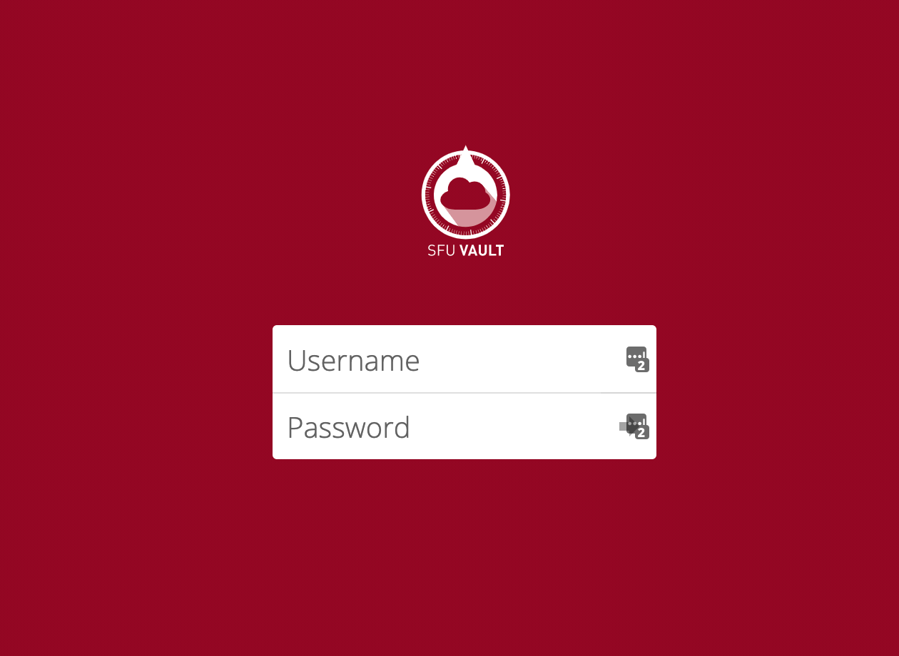

###### [Digital Transfer](../README.md) `|` [Procedures for Producers](procedures.md) `|` [FAQs](faqs.md)
###### Deposit folder

# How Do I Access My Deposit Folder?
Your **deposit folder** is on [SFU Vault](faq2-sfu-vault.md). How you access this folder depends on whether or not you have an ongoing [Digital transfer account](faq1-account.md) and whether you are connecting to Vault via the desktop or web version.

### SFU Vault desktop version
If you have a [Digital transfer account](faq1-account.md) and you have installed the desktop version of [SFU Vault](faq2-sfu-vault.md), the deposit folder should appear in the directory system on your local computer (accessible via Windows File Explorer or Mac Finder).
- The deposit folder is typically named `Deposit_<<OrgDeptName>>`.

You can access the folder and its contents like any other folder. **Transfer packages** you drag / move here will synchronize with the deposit folder on Vault.

### SFU Vault web version with transfer account

If you have a [Digital transfer account](faq1-account.md) but you have not installed the desktop version of SFU Vault, access your deposit folder via your web browser.

Open the url https://vault.sfu.ca.
- Enter your SFU computing credentials (account name and password).
- In the sidebar along the left, click the `Shared with you` link.
- Click the deposit folder that will appear in the list.
- You can drag transfer packages here or use the upload icon.

### SFU Vault web version with no transfer account
If you not have a [Digital transfer account](faq1-account.md), access your one-time deposit folder via your web browser.
- Open the url link you received from the Archives in [step 2 of the procedure](procedures.md#2-receive-a-link-to-a-deposit-folder-on-SFU-Vault).
- You can drag or use the upload icon to copy transfer package to the deposit folder.

###### Last updated: Nov 19, 2021
