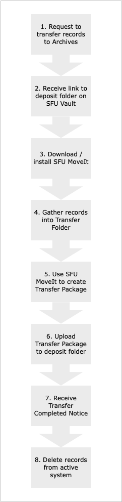

# Procedures for Producers

1. Contact the Archives to request to transfer digital records to the Archives.
* What can I transfer
* Who should I contact?
* Why might the Archives reject my request?

2. Receive a link to a deposit folder on SFU Vault.
* How long can I access the deposit folder?

3. Download SFU MoveIt, the Archives' packaging tool.
* Why do I need a packaging tool?
* How do I install it?
* How do I uninstall it?
* How do I know when an upgrade is available?

4. Gather records for transfer into a transfer folder.
* Tips

5. Use SFU MoveIt to create a transfer package.
* Should I put everything into one package?

6. Upload the transfer package to your deposit folder on SFU Vault.
* Are there size limits on transfer packages?
* Is there an alternative transfer method?

7. Receive the Transfer Completed Notice when the Archives has processed your transfer.
* What does "processing" involve?
* Do I need to keep the Transfer Completed Notice?

8. Delete the records from your active system.
* Can I keep my own copy of the records I transferred?
* How do I request a copy of a transferred record if I need it later?
