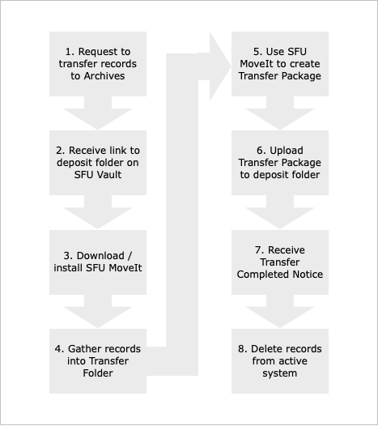

# Procedures for Producers with FAQs

This page is intended for producers of digital records – SFU staff and non-SFU donors – who want to transfer their digital materials to SFU Archives. It outlines 8 steps and provides answers to frequently asked questions relating to each step.

## 1. Contact the Archives to request to transfer digital records to the Archives
Not all digital records need or should be send to the Archives. An archivist will discuss with you the records you want transfer.  If you will be regularly making transfers, the archivist will create an on-going **digital transfer account** for you so that you can skip this step in the future.
- [What can I transfer](faq1-request.md#what-can-i-transfer)
- [Who should I contact?](faq1-request.md#who-should-i-contact)
- [Why might the Archives reject my request?](faq1-request.md#what-might-archives-reject-my-request)
- [Who should get a digital transfer account?][faq1-request.md#who-should-get-a-digital-transfer-account]

## 2. Receive a link to a deposit folder on SFU Vault
When the Archives accepts your request, an archivist will create a **deposit folder** for you on SFU Vault. If you have a  **digital transfer account** you will have  on-going access to the folder. For one-time transfers, your access will be time-limited.
- [What is SFU Vault/](faq2-deposit-folder.md#what-is-sfu-vault)
- [How do I access my deposit folder?(faq2-deposit-folder.md#how-do-i-access-my-deposit-folder)

3. Download SFU MoveIt, the Archives' packaging tool.
* Why do I need a packaging tool?
* How do I install it?
* How do I uninstall it?
* How do I know when an upgrade is available?

4. Gather records for transfer into a transfer folder.
* Tips

5. Use SFU MoveIt to create a transfer package.
* Should I put everything into one package?

6. Upload the transfer package to your deposit folder on SFU Vault.
* Are there size limits on transfer packages?
* Is there an alternative transfer method?

7. Receive the Transfer Completed Notice when the Archives has processed your transfer.
* What does "processing" involve?
* Do I need to keep the Transfer Completed Notice?

8. Delete the records from your active system.
* Can I keep my own copy of the records I transferred?
* How do I request a copy of a transferred record if I need it later?
