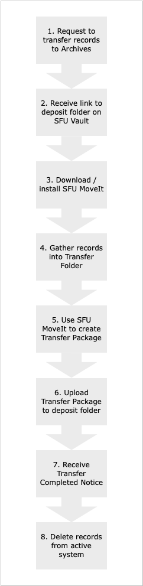

# Procedures for Producers with FAQs

This page is intended for **producers** of digital records – SFU staff and non-SFU donors – who want to transfer their records to SFU Archives. It outlines 8 steps and provides answers to frequently asked questions relating to each step.

### 1. Contact the Archives to request to transfer digital records to the Archives
Not all digital records need or should be send to the Archives. An archivist will discuss with you the records you want transfer.  If you will be regularly making transfers, the archivist will create an on-going **digital transfer account** for you so that you can skip this step in the future.
- [What can I transfer](faq1-what-can-i-transfer)
- [Who should I contact?](faq1-who-should-i-contact)
- [Why might the Archives reject my request?](faq1-why-might-archives-reject-my-request)
- [Who should get a digital transfer account?](faq1-who-should-get-a-digital-transfer-account)

### 2. Receive a link to a deposit folder on SFU Vault
When the Archives accepts your request, an archivist will create a **deposit folder** for you on SFU Vault. If you have a  **digital transfer account** you will have  on-going access to the folder. For one-time transfers, your access will be time-limited.
- [What is SFU Vault/](faq2-what-is-sfu-vault)
- [How do I access my deposit folder?](faq2-how-do-i-access-my-deposit-folder)

### 3. Download SFU MoveIt, the Archives' packaging tool.
**SFU MoveIt** is the Archives' packaging tool that creates standardized **transfer packages**. [Read more about it here](https://www.sfu.ca/archives/digital-preservation/sfu-moveit.html) and [download the latest version here](https://github.com/axfelix/moveit-electron) (`.exe` file = Windows version; `.dmg` file = Mac OS version).
- [Why do I need a packaging tool?](faq3-why-do-i-need-a-packaging-tool)
- [How do I install SFU MoveIt?](faq3-how-do-i-install-sfu-moveit)
- [How do I uninstall SFU MoveIt?](faq3-how-do-i-uninstall-sfu-moveit)
- [How do I know when an upgrade is available?](faq3-how-do-i-know-when-an-upgrade-is-available)

### 4. Gather records for transfer into a transfer folder
Create a **transfer folder** on your local machine and move here all the folders and files you will include in the transfer. This step segregates the material for transfer from other records that will remain in your active system: this will facilitate their eventual deletion at the end of the transfer process. Try to document the original directory structure and preserve files' original timestamps.
- [How do I document the original directory structure?](faq4-how-do-i-document-the-original-folder-structure)
- [What are timestamps and how do I preserve them?](faq4-what-are-timestamps-and-how-do-i-preserve-them)
- [Can I include password-protected or encrypted files?](faq4-can-i-include-password-protected-or-encrytped-files)
- [How do I transfer records from a database or content managemeent system?](faq4-how-do-i-transfer-records-from-a-database-or-content-management-system)

###  5. Use SFU MoveIt to create a transfer package
Use **SFU MoveIt** to convert your **transfer folder** into a standardized **transfer package** (a "bag") that follows the [BagIt File Packaging Format](https://datatracker.ietf.org/doc/html/rfc8493) specification. MoveIt also requires you to enter some minimal information about the transfer (e.g. your contact email and a brief description of the records).
- [How many transfer packages (bags) should I create?](faq5-how-many-transfer-packages-bags-should-i-create)
- [How do I use SFU MoveIt?](guide-to-sfu-moveit.md)
- [What is a BagIt bag?](faq5-what-is-bag.md)

### 6. Upload the transfer package to your deposit folder on SFU Vault
Access the **deposit folder** link you received in step 2
* Are there size limits on transfer packages?
* Is there an alternative transfer method?

7. Receive the Transfer Completed Notice when the Archives has processed your transfer.
* What does "processing" involve?
* Do I need to keep the Transfer Completed Notice?

8. Delete the records from your active system.
* Can I keep my own copy of the records I transferred?
* How do I request a copy of a transferred record if I need it later?
