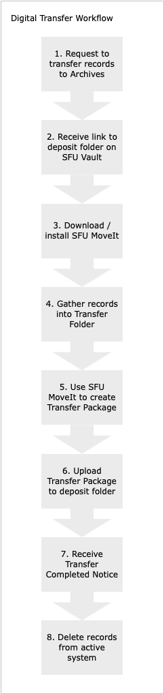

###### [Digital Transfer](../README.md) `|` Procedures for Producers `|` [FAQs](faqs.md)

# Transfer Procedures for Producers with FAQs

This page is intended for **producers** of digital records – SFU staff and non-SFU donors – who want to transfer their records to SFU Archives. It outlines the process and answers frequently asked questions relating to each step.

### 1. Contact the Archives to request to transfer digital records to the Archives
Not all digital records need or should be sent to Archives. An archivist will discuss with you the records you want to transfer. If you will be regularly transferring records, the archivist will create an on-going **Digital transfer account** for you so that you can skip this step in the future.
- [What can I transfer](faq1-transfer.md)
- [Who should I contact?](faq1-contact.md)
- [Why might the Archives reject my request?](faq1-request.md)
- [Who should get a Digital transfer account?](faq1-account.md)

### 2. Receive a link to a deposit folder on SFU Vault
When the Archives accepts your request, an archivist will create a **deposit folder** for you on SFU Vault. If you receive a **Digital transfer account** you will have  on-going access to the folder. For one-time transfers, your access will be time-limited.
- [What is SFU Vault/](faq2-sfu-vault.md)
- [How do I access my deposit folder?](faq2-deposit-folder.md)

### 3. Download SFU MoveIt, the Archives' packaging tool
**SFU MoveIt** is the Archives' packaging tool that creates standardized **transfer packages**. Read more [about MoveIt here](https://www.sfu.ca/archives/digital-preservation/sfu-moveit.html) and download the [latest version here](https://github.com/axfelix/moveit-electron) (`.exe` file = Windows version; `.dmg` file = Mac OS version).
- [Why do I need a packaging tool?](faq3-packaging-tool.md)
- [How do I install SFU MoveIt?](faq3-install-sfu-moveit.md)
- [How do I uninstall SFU MoveIt?](faq3-uninstall-sfu-moveit.md)
- [How do I know when an upgrade is available?](faq3-upgrade-sfu-moveit.md)

### 4. Gather records for transfer into a transfer folder
Create a **transfer folder** on your local machine and move here all the folders and files you will include in the transfer. This step segregates the material for transfer from other records that will remain in your active system: this will facilitate their eventual deletion at the end of the transfer process. Try to document the original directory structure and preserve files' original timestamps.
- [How do I document the original directory structure?](faq4-directory-structure.md)
- [What are timestamps and how do I preserve them?](faq4-timestamps.md)
- [Can I include password-protected or encrypted files?](faq4-encryption.md)
- [How do I transfer records from a database or content management system?](faq4-databases.md)

###  5. Use SFU MoveIt to create a transfer package
Use **SFU MoveIt** to convert your **transfer folder** into a standardized **transfer package** (a "bag") that follows the [BagIt File Packaging Format](https://datatracker.ietf.org/doc/html/rfc8493) specification. MoveIt also requires you to enter some minimal information about the transfer (e.g. your contact email and a brief description of the records).
- [How do I use SFU MoveIt?](guide-to-sfu-moveit.md)
- [How many transfer packages (bags) should I create?](faq5-how-many-transfer-packages.md)
- [What is a BagIt bag?](faq5-what-is-bag.md)

### 6. Upload the transfer package to your deposit folder on SFU Vault
Access the **deposit folder** link you received in step 2 and upload the **transfer package(s)** you created in step 5. The Archives will receive an automated notice of the deposit. You should receive a **Notice of receipt** from the Archives within 1 business day.
- [Are there size limits on uploads to Vault?](faq6-size-limits.md)
- [Why didn't I receive a Notice of receipt?](faq6-wnotice-of-receipt.md)
- [Is there an alternate transfer method?](faq6-tranfer-methods.md)

### 7. Receive notice that the Archives has processed your transfer
When the an archivist has finished processing your transfer, you will receive a **Transfer completed notice**. It includes the transfer **Accession number** and a **Transfer list** showing all the folders or files that you transferred.
- [What does "processing" involve?](faq7-processing.md)
- [Do I need to keep the Transfer completed notice?](faq7-keep-notice)

### 8. Delete the records from your active system
The records have now passed into the custody and control of the Archives and can be deleted from your active system. Deletion ensures that you will not unintentionally re-transfer the same records at a later date. For university records, it also ensures that your department is in compliance with the applicable records retention schedule (RRSDA) and that you minimize the risk of unauthorized access, use or disclosure of any personal or confidential information contained in the records.
- [What should I delete?](faq8-delete.md)
- [Can I keep my own copy of the records I transferred?](faq8-keep-copies.md)
- [How do I request a copy of a transferred record if I need it later?](faq8-retreivals.md)

### Have other questions?
Contact the Archives at archives@sfu.ca.

###### Last updated: Nov 18, 2021
